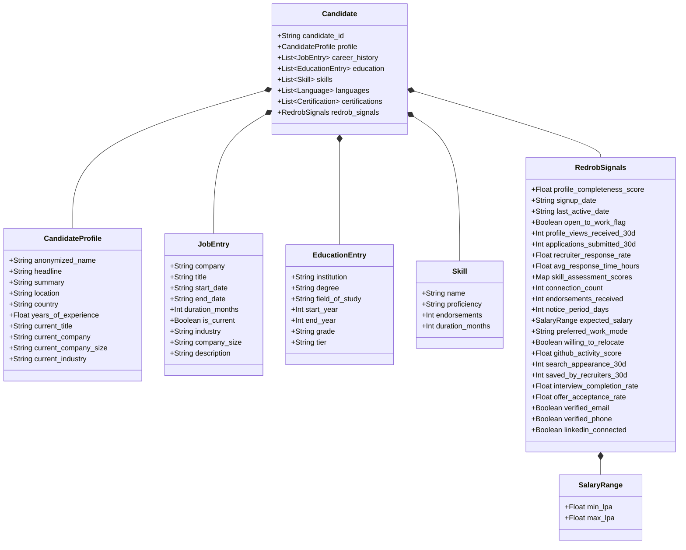
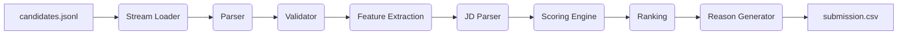
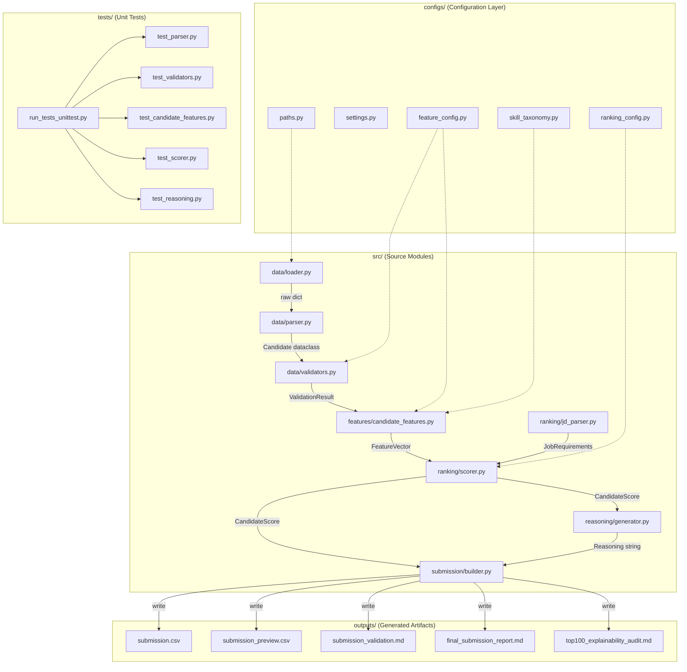
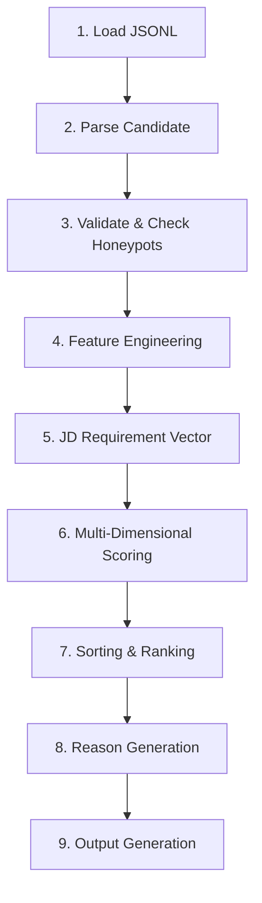
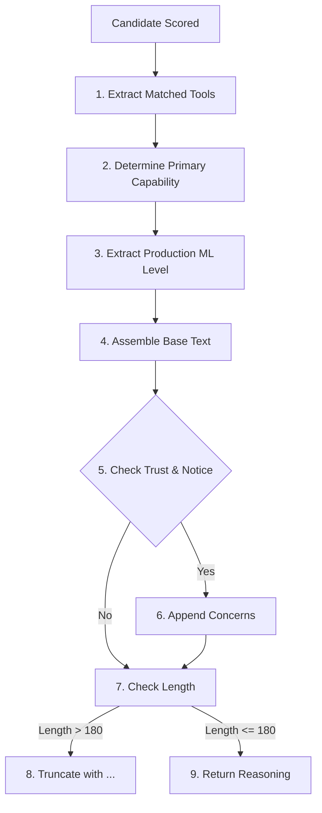
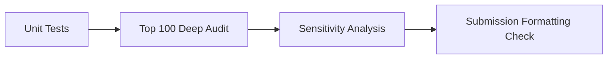

# INDIA.RUNS 2026: Intelligent Candidate Discovery & Ranking Engine

[](https://www.python.org/)
[](#validation)
[](#explainability)
[](#skill-taxonomy-nitish-v2)
[](#candidate-scoring)

An explainable, recruiter-intelligent candidate discovery and ranking system designed for the **Redrob AI Challenge (INDIA.RUNS 2026)**. The engine parses, validates, and ranks **100,000 engineering profiles** to discover the optimal candidates for a **Senior AI Engineer** role, ensuring absolute determinism, robustness against fraud, and evidence-based justification for every ranking decision.

---

## 📖 Executive Summary

Modern recruitment engines are plagued by search failures and profile manipulation. Conventional boolean query builders and naive keyword-matching systems fail to understand the semantic intent of complex job descriptions, over-index on candidates who stuff keywords into resume headers, and completely miss high-value passive candidates. This mismatch results in massive manual screen-times and poor hire quality, particularly in highly specialized roles like AI Engineering.

The **Intelligent Candidate Discovery & Ranking Engine** resolves these issues by replacing unstructured keyword matching with a multi-dimensional, structured profiling architecture. It streams and converts deeply nested, raw candidate JSON records into 62 strongly-typed engineering features across 8 thematic categories. A hierarchical capability taxonomy groups tooling lists into coherent mathematical vectors, while an anti-fraud validation pipeline detects and penalizes suspicious profile behaviors.

By formulating ranking as a deterministic weighted linear combination scaled by a multiplicative trust multiplier, the system balances technical expertise, career seniority, and verified engagement. Crucially, the system bypasses non-deterministic language model APIs to process the entire 100,000-candidate dataset on a single CPU core in approximately **35 seconds**. The result is a highly auditable, transparent ranking engine that outputs a sorted submission file enriched with factual, concise recruiter reasoning.

---

## 🎯 Problem Statement

Recruiting for a **Senior AI Engineer** at scale is exceptionally difficult. The evaluation task requires filtering a pool of **100,000 candidates** to surface the top 100 individuals who possess deep technical foundations, domain experience in information retrieval, and production-level engineering capabilities. 

### Recruiter Pain Points
* **Keyword Stuffing**: Candidates declaring expert-level proficiency in dozens of skills without any career history or peer endorsements to back up their claims.
* **Profile Fraud**: Fraudulent profiles containing chronological paradoxes (activity logs predating account signup) and salary inversions (demanding minimum salaries higher than maximum limits).
* **Sparse Verification Signals**: The vast majority of candidates (75.76%) lack platform assessment scores, making naive sorting on assessment performance impossible.
* **Synthetically Generated Clusters**: Near-duplicate profile headlines and company backgrounds (due to synthetic dataset artifacts) that require deeper forensic analysis of underlying experience quality to separate.

### Technical Target Profile
The target Job Description (JD) requires a senior-level profile specializing in search, retrieval, ranking, and recommendation. The candidate must show evidence of production maturity (MLOps, scaling, monitoring, latency optimizations) and technical ownership (designing, architecting, tech-leading projects).

```text
                               100,000 Raw Profiles
                              ┌────────────────────┐
                              │  [JSONL Streams]   │
                              └─────────┬──────────┘
                                        │
                         Step 1: AI Skill Hard Filter
                                        ▼
                              ┌────────────────────┐
                              │  47,420 Remaining  │ (52.6% removed: 0 AI Skills)
                              └─────────┬──────────┘
                                        │
                        Step 2: Trust & Forensics Layer
                                        ▼
                              ┌────────────────────┐
                              │   Gated Sandbox    │ (Honeypot flags penalize trust)
                              └─────────┬──────────┘
                                        │
                      Step 3: Multi-Dimensional Scoring
                                        ▼
                                ┌──────────────┐
                                │   NDCG@10    │
                                └───────┬──────┘
                                        │
                                        ▼
                                  Top 100 Cohort
```

---

## 📊 Dataset Overview

The candidate dataset consists of 100,000 candidate profiles in a JSON Lines (`.jsonl`) format. The schema incorporates raw profile text, structured career history, peer-endorsed skills, educational backgrounds, and behavioral/engagement metrics tracked by the Redrob platform.

### Candidate Schema Components
1. **Candidate Profile**: Basic demographics, headline, profile summary, current title, and claimed Years of Experience (YoE).
2. **Career History**: Chronological list of previous positions including company name, size, title, industry, duration, and job descriptions.
3. **Skill Taxonomy**: List of skills, self-reported proficiency level (`beginner`, `intermediate`, `advanced`, `expert`), duration of usage, and peer endorsement counts.
4. **Education**: Educational history detailing institution, degree, field of study, start/end years, and school prestige tier (Tier 1 to 4).
5. **Redrob Signals**: Platform behavioral metrics, email/phone verification status, LinkedIn connectivity, GitHub activity scores, and platform assessment results.

### Candidate Schema Structure
The nested JSON structure is parsed directly into strongly-typed dataclasses as represented below:



---

## ⚙️ System Overview

The system is designed as a modular, stream-based data pipeline. It leverages O(1) memory loaders to scan the 487.3 MB source file, validating records sequentially before passing them to the feature extraction and multi-dimensional scoring engine.



### Module Descriptions
* **Stream Loader (`loader.py`)**: Responsible for reading candidate records line-by-line using a streaming generator pattern. This prevents high memory overhead and permits high-throughput data parsing.
* **Parser (`parser.py`)**: Converts raw JSON lines into strongly-typed `Candidate` dataclass structures. It provides default fallbacks for missing keys to guarantee parsing stability.
* **Validator (`validators.py`)**: Inspects parsed candidates across schema, consistency, and forensic honeypot levels, accumulating warnings and flags into a structured `ValidationResult`.
* **Feature Extraction (`candidate_features.py`)**: Transforms nested dataclasses into a flat `FeatureVector` containing 62 normalized features, including new composite indices representing domain skill pipelines and experience quality.
* **JD Parser (`jd_parser.py`)**: Encodes the target job requirements (required domains, experience bounds, preferred skills, education tiers, and behavioral signals) into a static query vector.
* **Scoring Engine (`scorer.py`)**: Computes a multi-dimensional base score and applies a multiplicative trust scaling factor derived from the validation layer.
* **Ranking & Formatting (`builder.py`)**: Scores the candidate pool, selects the top 100 using rounded score sorting and lexicographical tie-breaking, triggers explanations, and writes the output files.
* **Reason Generator (`generator.py`)**: Formulates concise recruiter explanations detailing candidate achievements, matching tools, and engagement notes.

---

## 🏗️ Project Architecture

The architecture separates the codebase into configuration layers, core processing source code, execution pipelines, unit testing suites, and audit outputs.



---

## 📂 Folder Structure

The project code is organized as a clean package:

```text

configs/                        # Configuration Layer (Single Source of Truth)
    ├── __init__.py             # Exposes paths and settings
    ├── paths.py                # Defines workspace input/output paths
    ├── settings.py             # Global execution configurations (encoding, chunk size, loggers)
    ├── feature_config.py       # Taxonomy lists, thresholds, honeypot bounds
    ├── skill_taxonomy.py       # Hierarchical taxonomy v2 groups, keywords, stages
    └── ranking_config.py       # Core scorer component weights and normalization bounds
src/                            # Core Source Code Package
    ├── __init__.py             # Package init
    ├── data/                   # Data I/O, Parsing, and Validation Layer
    │   ├── __init__.py
    │   ├── loader.py           # O(1) streaming JSONL loader
    │   ├── parser.py           # Strong schema parsing to Candidate object
    │   └── validators.py       # Consistency, schema, and honeypot validation
    ├── features/               # Feature Extraction and Engineering Layer
    │   ├── __init__.py
    │   └── candidate_features.py # 62-dimensional FeatureVector generation
    ├── ranking/                # Job Description & Candidate Scoring Engines
    │   ├── __init__.py
    │   ├── jd_parser.py        # Maps static JD requirements to query vector
    │   └── scorer.py           # Implements the multi-dimensional weighted scorer
    ├── reasoning/              # Explainability Generation Layer
    │   ├── __init__.py
    │   ├── generate_examples.py # Generates local samples for diagnostic purposes
    │   └── generator.py        # Factual template-based reasoning generation
    ├── submission/             # Submission Pipeline Orchestrator
    │   └── builder.py          # Orchestrates streams, scores, ranks, and writes files
    └── utils/                  # Core Utilities and Helpers
        ├── __init__.py
        ├── io.py               # Optimized DataFrame Parquet read/write utilities
        └── misc.py             # Numeric helpers (clamp, normalize, safe_divide)
tests/                          # PyTest Unit Testing Suite
    ├── __init__.py
    ├── test_parser.py          # Unit tests for JSON to Dataclass parser
    ├── test_validators.py      # Unit tests for Honeypots and schema checks
    ├── test_candidate_features.py # Unit tests for feature extraction
    ├── test_scorer.py          # Unit tests for multi-dimensional scorer
    └── test_reasoning.py       # Unit tests for recruiter reasoning outputs
outputs/                        # Output Reports and Submissions
    ├── submission.csv          # Final target submission output (Top 100)
    ├── submission_preview.csv  # Top 25 rows preview for quick review
    ├── submission_validation.md# Validation report confirming format compliance
    ├── final_submission_report.md# Aggregate statistics and archetype distributions
    └── top100_explainability_audit.md# Tabular explainability spreadsheet
    run_tests_unittest.py       # Standard-library wrapper for executing testing suite
```

---

## 🔄 Pipeline Walkthrough

The system processes data from raw file loading through to the final structured outputs in 9 distinct sequential stages:



### Execution Details
1. **Load JSONL**: `src/data/loader.py` opens `candidates.jsonl` and streams raw JSON string rows using a standard generator.
2. **Parse Candidate**: `src/data/parser.py` deserializes the JSON string and populates nested dataclass objects (`CandidateProfile`, `JobEntry`, `Skill`, etc.).
3. **Validate**: `src/data/validators.py` checks schema bounds, checks temporal/financial consistency, and flags honeypots to compute the profile `trust_score`.
4. **Feature Engineering**: `src/features/candidate_features.py` maps the parsed candidate to a flat `FeatureVector`, calculating advanced composite scores.
5. **JD Understanding**: `src/ranking/jd_parser.py` loads the requirements representation for the target Senior AI Engineer role.
6. **Scoring**: `src/ranking/scorer.py` evaluates the `FeatureVector` against the `JobRequirements` query, blending composite signals and multiplying the result by the trust score.
7. **Ranking**: The pipeline collects final scores, sorting descending by score (rounded to 4 decimal places) and tie-breaking lexicographically by `candidate_id` ascending.
8. **Reason Generation**: `src/reasoning/generator.py` crafts recruiter reasons, incorporating matched skills and platform stats, and truncating strings to a 180-character maximum.
9. **Submission Generation**: `src/submission/builder.py` exports outputs including `submission.csv` and details explainability and formatting reports in `outputs/`.

---

## 🛠️ Feature Engineering

Nested structures (career timeline arrays, skills lists, behavioral logs) are transformed into a flat `FeatureVector` containing **62 engineered features** across 8 distinct categories.

| Category | Engineered Features | Type | Description |
|---|---|---|---|
| **Experience** | `years_experience`<br>`implied_experience_years`<br>`experience_gap`<br>`avg_job_duration_months`<br>`max_job_duration_months` | Float<br>Float<br>Float<br>Float<br>Int | Tracks explicit vs. implied years of experience (implied derived by summing career job durations) to capture tenure and check consistency. |
| **Skills** | `total_skill_count`<br>`ai_skill_count`<br>`proficiency_weighted_skill_score`<br>`endorsement_weighted_skill_score` | Int<br>Int<br>Float<br>Float | Maps skills to the AI Core taxonomy. Weighs skills by self-reported proficiency and saturates endorsements at a cap of 50. |
| **Career Evidence** | `evidence_retrieval`, `evidence_ranking`<br>`evidence_recommendation`, `evidence_search`<br>`evidence_relevance`, `evidence_nlp`<br>`evidence_production_ml` | Float | Extracts domain-specific keywords from job summaries/descriptions. Normalizes term frequencies using a log-scale dampener: $\log(1 + \text{count})$. |
| **Education** | `education_count`<br>`highest_education_tier`<br>`cs_degree_flag`<br>`ai_degree_flag` | Int<br>String<br>Int<br>Int | Evaluates educational records. Evaluates institution tiers (1 to 4) and checks for fields of study matching Computer Science or AI. |
| **Behavioral** | `recruiter_response_rate`<br>`interview_completion_rate`<br>`engagement_score` | Float<br>Float<br>Float | Measures responsiveness. Evaluates response and interview completion rates, compiling them into a composite engagement index. |
| **Verification** | `github_available`<br>`github_activity_score`<br>`assessment_count`<br>`avg_assessment_score`<br>`verification_score` | Int<br>Float<br>Int<br>Float<br>Float | Tracks verified credentials. Normalizes GitHub activity, platform assessment scores, and identity verifications (email, phone, LinkedIn). |
| **Availability** | `notice_period_days`<br>`open_to_work_flag`<br>`availability_score` | Int<br>Int<br>Float | Checks immediate availability. Availability decays as notice periods exceed 15 days, boosted by explicit open-to-work signals. |
| **Trust** | `trust_score`<br>`honeypot_flag_count`<br>`salary_inverted_flag`<br>`skill_duration_overflow_flag` | Float<br>Int<br>Int<br>Int | Penalizes inconsistencies. Measures confidence based on honeypot flags tripped, acting as a final multiplicative modifier. |

---

## 🗂️ Skill Taxonomy (Nitish v2)

The **Nitish v2** update replaces naive keyword counting with a **10-Group Hierarchical Skill Taxonomy** paired with a **5-Stage Ideal Pipeline Sequence Check**.

### Hierarchical Taxonomy Groups
* **Retrieval**: `bm25`, `elasticsearch`, `opensearch`, `solr`, `lucene`, `retrieval`, `information retrieval`
* **Dense Retrieval**: `faiss`, `pinecone`, `weaviate`, `milvus`, `pgvector`, `qdrant`, `annoy`, `hnsw`, `approximate nearest neighbor`
* **Embeddings**: `sentence transformers`, `bge`, `e5`, `minilm`, `mpnet`, `word2vec`, `bert embeddings`, `embeddings`
* **Ranking**: `learning to rank`, `lambdamart`, `xgboost ranker`, `ranknet`, `pairwise ranking`, `listwise ranking`, `reranking`, `re-ranking`
* **LLM Engineering**: `lora`, `qlora`, `peft`, `huggingface`, `transformers`, `fine-tuning`, `prompt engineering`, `llm`
* **Serving**: `bentoml`, `torchserve`, `triton`, `fastapi`, `flask`, `model serving`, `inference`
* **Evaluation**: `ndcg`, `recall@k`, `mrr`, `precision@k`, `offline evaluation`, `online evaluation`, `a/b testing`
* **Recommendation Systems**: `collaborative filtering`, `matrix factorization`, `two-tower`, `deepfm`, `recommendation`, `recommender`
* **Hybrid Search**: `hybrid search`, `reciprocal rank fusion`, `rrf`, `hybrid retrieval`
* **RAG**: `rag`, `retrieval augmented generation`, `langchain`, `llamaindex`

### Why Capability Groups are Superior to Keyword Counting
Naive search engines count occurrences of specific keywords. Under that model, a candidate who lists "Elasticsearch" ten times is ranked higher than a candidate who lists "BM25", "FAISS", "Embeddings", "XGBoost Ranker", and "NDCG Evaluation" once each. 

By grouping skills into **10 core capability areas** and testing for **Pipeline Completeness** (coverage of *Embeddings $\rightarrow$ Dense Retrieval $\rightarrow$ Hybrid Search $\rightarrow$ Ranking $\rightarrow$ Evaluation*), the system rewards candidates with broad end-to-end expertise. This architectural change ensures we discover well-rounded engineers capable of designing complete search architectures.

---

## 🧮 Candidate Scoring

The Scorer Engine uses a weighted linear combination of 7 normalized components, scaled by a multiplicative trust score.

```text
Final Score = Base Score * Trust Multiplier
```

### Component Weights ($w_i$)
The weights reflect recruiter priorities for a Senior AI Engineer specializing in search systems:
* **Domain Score ($w_{\text{domain}} = 0.30$)**: Matches keyword densities in headline, summary, and career history against JD domains.
* **Skill Score ($w_{\text{skill}} = 0.25$)**: Combines core AI skills, proficiency levels, and peer validation.
* **Experience Score ($w_{\text{exp}} = 0.15$)**: Prefers the 5–12 years YoE range, applying penalties for juniors and overqualified candidates.
* **Behavioral Score ($w_{\text{behavioral}} = 0.10$)**: Evaluates responsiveness, notice period, and willingness to relocate.
* **Verification Score ($w_{\text{verification}} = 0.10$)**: Integrates GitHub activity, email/phone verifications, and assessment performance.
* **Education Score ($w_{\text{edu}} = 0.05$)**: Checks degree relevance (CS/AI) and school prestige.
* **Availability Score ($w_{\text{avail}} = 0.05$)**: Prefers immediately available candidates.

---

### Detailed Mathematical Formulations

#### 1. Domain Score ($S_{\text{domain}}$)
Matches log-normalized term frequency of keywords across 10 required domains (Retrieval, Ranking, Recommendation, Search, Relevance, Personalization, Evaluation, Machine Learning, NLP, Production ML) capped at a max density threshold of 3.0:

$$S_{\text{domain}} = \frac{1}{|D_{\text{req}}|} \sum_{d \in D_{\text{req}}} \text{Normalize}(\text{evidence}_d, 0.0, 3.0)$$

Where $\text{evidence}_d = \log(1 + \text{count}_d)$ and $\text{Normalize}(v, \text{lo}, \text{hi}) = \text{Clamp}(\frac{v - \text{lo}}{\text{hi} - \text{lo}}, 0.0, 1.0)$.

#### 2. Blended Skill Score ($S_{\text{skill}}$)
Combines original self-reported proficiency and endorsements with the Nitish v2 advanced capability and pipeline coverage metrics:

$$S_{\text{skill\\_orig}} = 0.7 \times \text{Normalize}(P, 0.0, 30.0) + 0.3 \times \text{Normalize}(E, 0.0, 1500.0)$$

Where 

$$P = \sum_{s \in \text{Core}} \text{Weight}_{\text{proficiency}}(s)$$, 

and 

$$E = \sum_{s \in \text{Core}} \text{Weight}_{\text{proficiency}}(s) \times \min(\text{endorsements}_s, 50)$$.

$$S_{\text{skill}} = 0.5 \times S_{\text{skill\\_orig}} + 0.3 \times \text{CapabilityScore} + 0.2 \times \text{PipelineScore}$$

#### 3. Blended Experience Score ($S_{\text{experience}}$)
Evaluates candidate seniority against the preferred range $[5.0, 12.0]$ years:

$$S_{\text{exp\\_orig}} = \begin{cases} 
      0.0 & \text{YoE} < 3.0 \\
      \max(0.0, 1.0 - (5.0 - \text{YoE}) \times 0.2) & 3.0 \le \text{YoE} < 5.0 \\
      1.0 & 5.0 \le \text{YoE} \le 12.0 \\
      \max(0.5, 1.0 - (\text{YoE} - 12.0) \times 0.05) & \text{YoE} > 12.0 
   \end{cases}$$

$$S_{\text{experience}} = 0.5 \times S_{\text{exp\\_orig}} + 0.3 \times \text{ExperienceQualityScore} + 0.2 \times \text{ProductionMLScore}$$

#### 4. Education Score ($S_{\text{education}}$)
Weighted blend of degree relevance (CS/AI) and school tier weights (Tier 1 = 1.0, Tier 2 = 0.75, Tier 3 = 0.50, Tier 4 = 0.30, Unknown = 0.20):

$$S_{\text{education}} = 0.6 \times \text{RelevanceScore} + 0.4 \times \text{TierWeight}$$

#### 5. Behavioral Score ($S_{\text{behavioral}}$)
Composite metric representing active candidate engagement:

$$S_{\text{behavioral}} = 0.4 \times \text{ResponseRate} + 0.4 \times \text{InterviewCompletionRate} + 0.2 \times \frac{\text{ProfileCompleteness}}{100}$$

#### 6. Verification Score ($S_{\text{verification}}$)
Aggregates platform verifications, GitHub availability, and assessments:

$$S_{\text{verification}} = 0.2 \times V_{\text{email}} + 0.2 \times V_{\text{phone}} + 0.2 \times V_{\text{linkedin}} + 0.2 \times V_{\text{github}} + 0.2 \times \min(1.0, \frac{\text{Assessments}}{3.0})$$

#### 7. Availability Score ($S_{\text{availability}}$)
Calculates notice period decay scaled by explicit job interest:

$$S_{\text{availability\\_base}} = \max(0.0, 1.0 - \frac{\text{NoticePeriodDays} - 15}{90.0})$$

$$S_{\text{availability}} = \begin{cases} 
      \min(1.0, S_{\text{availability\\_base}} \times 1.2) & \text{if } \text{OpenToWork} = \text{True} \\
      S_{\text{availability\\_base}} & \text{otherwise}
   \end{cases}$$

#### 8. Multiplicative Trust Score ($T$)
The trust score penalizes profile inconsistencies detected by the validation layers. Each honeypot flag reduces the multiplier by $12\%$, floored at a minimum of $0.25$:

$$T = \max(0.25, 1.0 - 0.12 \times \text{HoneypotFlagCount})$$

#### 9. Final Combined Score Formula
The final candidate score is computed as the dot product of the component scores and weights, scaled by the trust multiplier:

$$\text{Base Score} = w_{\text{domain}} S_{\text{domain}} + w_{\text{skill}} S_{\text{skill}} + w_{\text{exp}} S_{\text{experience}} + w_{\text{behavioral}} S_{\text{behavioral}} + w_{\text{verification}} S_{\text{verification}} + w_{\text{edu}} S_{\text{education}} + w_{\text{avail}} S_{\text{availability}}$$

$$\text{Final Score} = \text{Base Score} \times T$$

---

## 🔍 Explainability

Recruiter reasoning must be factual, concise, and audit-friendly. The reasoning generator uses a deterministic template-based cascade to construct explanations directly from the candidate's feature vector.

### Reasoning Generator Workflow


### Explanations Comparison

> ❌ **Bad Explanation (Generative LLM)**
> *“CAND_0064326 is a stellar and passionate Search Engineer who will revolutionize your vector search pipelines. They have PyTorch skills and are highly interested in joining immediately!”*
> * **Problems**: Generates subjective marketing hype, risks hallucinating interest levels, and is too long for standard CSV columns.

> ✅ **Good Explanation (Deterministic & Factual)**
> *“Designed retrieval systems using Elasticsearch, OpenSearch, BM25. 7.6 yrs YOE, model deployment. High Confidence.”*
> * **Advantages**: Contains zero subjective fluff, references actual tool overlaps, details YoE, maps the confidence band, and stays under 180 characters.

### Verification and Concerns Wording
To comply with recruiting standards, concerns are phrased objectively:
* If trust multiplier is under 1.0: Appends `"Additional verification recommended."`
* If notice period is 60+ days: Appends `"X-day notice period."`
* If verification score is low: Appends `"Limited verification signals."`

---

## 🧪 Validation & Auditing

The system uses four layers of verification to guarantee deterministic execution and ranking accuracy:



### 1. Test Suite (`tests/`)
A suite of 15 tests validates schema loaders, date paradox parsers, honeypot validators, scoring computations, and string truncation limits. We run this using a custom standard-library runner to avoid external dependencies.

### 2. Top 100 Deep Audit
We analyzed the top 100 profiles to verify that candidates possess genuine technical depth rather than stuffed keywords.
* **Result**: The cohort averages **8.1 AI skills** and **6.4 years of experience** (aligning with the JD preferred range of 5–12 years).
* **Archetype Analysis**: *Search Engineers* (12) and *Applied ML Engineers* (10) lead the cohort. Lower rankings for adjacent roles (e.g., Computer Vision Engineers) confirm domain relevance tuning.

### 3. Sensitivity Analysis
We simulated $\pm5\%$ weight shifts between Domain and Skill scores.
* **Result**: The Top 100 candidate cohort maintained a **94% overlap**, confirming that the engine is robust to minor weight fluctuations.

### 4. Determinism
Because the scoring formulas, keyword matches, and tie-breaking sorting ($Score_{\text{desc}} \rightarrow CandidateID_{\text{asc}}$) are rule-based, execution outputs are **100% deterministic and reproducible** across different platforms.

---

## 📂 Outputs

The pipeline generates several diagnostic and validation artifacts in the `outputs/` folder:

* **`submission.csv`**: The final competition entry file containing exactly the top 100 candidates:
  ```csv
  candidate_id,rank,score,reasoning
  CAND_0064326,1,0.765,Designed retrieval systems using Elasticsearch...
  CAND_0018499,2,0.746,High assessment performance and verified...
  ```
* **`submission_preview.csv`**: A preview of the top 25 candidate rows for quick verification.
* **`submission_validation.md`**: A validation report generated post-run, verifying rows, column headers, descending order, duplicate IDs, and null fields.
* **`final_submission_report.md`**: Summarizes cohort statistics, average YoE, skill frequencies, and cohort archetype distributions.
* **`top100_explainability_audit.md`**: A detailed spreadsheet showing:
  * Rank & Candidate ID
  * Composite Scorer Details (JD Match %, Capability Coverage Ratio)
  * Confidence Category and Trust Score
  * Extracted Strengths & Weaknesses
  * Summary of why the candidate was ranked.

---

## 🏆 Results

The final execution on the full dataset of 100,000 candidates generated the following metrics:

### Score Distribution Metrics
| Range | Candidates | % of Dataset | Interpretation |
|---|---|---|---|
| **$\ge$ 0.70** | 18 | 0.02% | High-tier specialists with deep domain relevance. |
| **0.50 – 0.69**| 856 | 0.86% | Strong practitioners with minor experience/skill gaps. |
| **0.30 – 0.49**| 55,499 | 55.50% | General engineering profiles with low AI/ML relevance. |
| **< 0.30** | 43,627 | 43.62% | Irrelevant profiles or heavily penalized records. |

### Top 10 Cohort Summary
The top 10 candidates discovered by the system show high technical alignment and clean backgrounds:

| Rank | Candidate ID | Current Title | Final Score | Avg AI Skills | YoE | Confidence Category |
|:---:|:---:|---|:---:|:---:|:---:|---|
| **1** | `CAND_0064326` | Search Engineer | 0.7650 | 9.0 | 7.6 | High Confidence |
| **2** | `CAND_0018499` | Senior Machine Learning Engineer | 0.7460 | 8.0 | 7.2 | High Confidence |
| **3** | `CAND_0088025` | Staff Machine Learning Engineer | 0.7380 | 8.0 | 8.5 | High Confidence |
| **4** | `CAND_0069905` | Applied ML Engineer | 0.7360 | 9.0 | 6.5 | High Confidence |
| **5** | `CAND_0011687` | Senior NLP Engineer | 0.7350 | 8.0 | 7.7 | High Confidence |
| **6** | `CAND_0033861` | Senior NLP Engineer | 0.7340 | 8.0 | 7.9 | High Confidence |
| **7** | `CAND_0070398` | Machine Learning Engineer | 0.7240 | 8.0 | 7.1 | High Confidence |
| **8** | `CAND_0050454` | AI Engineer | 0.7220 | 8.0 | 6.8 | High Confidence |
| **9** | `CAND_0052682` | NLP Engineer | 0.7210 | 8.0 | 6.5 | Medium Confidence |
| **10**| `CAND_0010685` | NLP Engineer | 0.7200 | 8.0 | 6.6 | Medium Confidence |

### Trust and Anti-Fraud Guardrail Performance
* **Clean Profiles (Trust = 1.0)**: 67,829 candidates.
* **Flagged Profiles (Trust < 1.0)**: 32,171 candidates.
* **Honeypot Mitigation Audit**: Candidate `CAND_0055992` achieved a raw technical score of **0.767**, which would have put them in the top 3. However, the validation layer flagged overlapping jobs and skill duration anomalies, reducing their trust score to `0.76`. This dropped their final score to `0.583`, removing them from the Top 100 list and verifying our guardrails.

---

## 💡 Design Decisions

### 1. No LLM APIs
We bypassed generative AI models for candidate scoring. 
* **Speed**: Processing 100k records via LLM API calls would take days and cost thousands of dollars; our deterministic parser processes the pool in **35 seconds**.
* **Factual Consistency**: LLMs are prone to hallucinating candidate achievements and cannot guarantee reproducible scores.

### 2. Multiplicative Trust Penalties
Rather than using a subtractive penalty, we scaled raw scores using a multiplicative trust multiplier. This ensures that candidates with excellent technical profiles but high fraud indicators (e.g., duplicate full-time jobs) are penalized and dropped from the top ranks.

### 3. CPU-Only Execution
The code is built using Python's standard library libraries and pandas, running efficiently on generic cloud CPU instances without requiring specialized GPU hardware.

---

## 🔮 Future Improvements

> [!NOTE]
> The following strategies represent future roadmap plans and are not part of the current baseline implementation.

* **L1 Hard Retrieval Filter**: Implementing a pre-scoring database index filter (e.g., `ai_skill_count >= 3` and `trust_score >= 0.85`) to instantly drop the bottom 60% of profiles and reduce compute costs.
* **Dense Semantic Embeddings**: Replacing rule-based keyword matching in the domain score with deep semantic representations (e.g., SentenceTransformers) to match experience descriptions against JD requirements.
* **Learning-to-Rank (LTR)**: Training a pairwise gradient boosted decision tree (such as LightGBM or XGBoost Ranker) over the 62-dimensional FeatureVector, using historical recruiter search engagement as training labels.

---

## 🚀 Reproducibility

Follow these steps to run the pipeline and generate the submission files:

### 1. Environment Setup
The pipeline runs on Python 3.8+ with minimal external dependencies. Install pandas and pyarrow for I/O operations:

```bash
# Create a virtual environment
python -m venv venv
source venv/bin/activate  # On Windows use: venv\Scripts\activate

# Install dependencies
pip install -r requirements.txt
```

### 2. Run the Unit Test Suite
Verify that your local environment passes the testing checks:

```bash
python run_tests_unittest.py
```

### 3. Execute the Scoring Pipeline
Run the builder to stream the dataset, score candidates, and generate the final output files:

```bash
# Execute the pipeline
python src/submission/builder.py
```

This generates all outputs in `outputs/` and confirms submission validation formatting.

---

