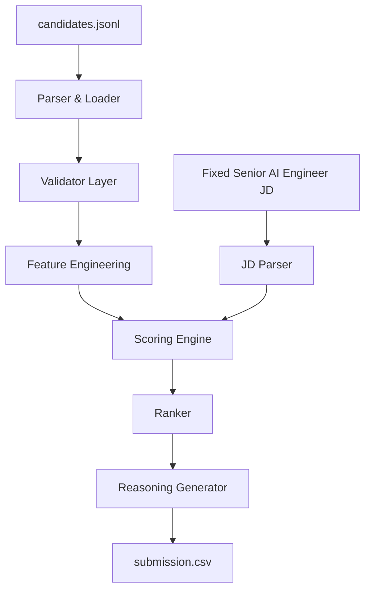

# INDIA.RUNS 2026 — Intelligent Candidate Discovery & Ranking

## Problem Statement

The **Redrob AI Challenge (INDIA.RUNS 2026)** requires building an intelligent candidate discovery system capable of ranking 100,000 engineering candidates for a **Senior AI Engineer** role. Traditional boolean and keyword search systems often fail by missing semantic intent, over-indexing on keyword stuffers, and failing to detect fraudulent or bloated profiles. 

Our goal is to build an explainable, recruiter-intelligent ranking engine that surfaces the absolute best candidates while providing factual, deterministic reasoning for why a candidate was ranked highly.

---

## Dataset Overview

The dataset consists of **100,000 candidate profiles** in JSONL format. Each profile includes:
- **Profile Data:** Headline, Summary, Location, Claimed YoE.
- **Career History:** Job titles, companies, durations, and descriptions.
- **Skills:** Peer-endorsed platform skills and proficiency levels.
- **Education:** Institutions, degrees, and majors.
- **Behavioral Signals:** Recruiter response rates, notice periods, and interview completion rates.
- **Verification Signals:** GitHub activity, verified contact details, and assessment scores.

### Major Forensic Findings
During Phase 1 (Data Forensics), we uncovered critical data quality issues that necessitated a rigorous validation layer:
- **52.6% of candidates** had zero AI skills, indicating a large portion of the dataset was not aligned with the target Senior AI Engineer role.
- **Salary Inversions:** 18.9% of candidates had expected salary minimums higher than their maximums.
- **Skill Duration Anomalies:** Candidates claiming 10+ years of a skill with only 2 years of career history.
- **Date Paradoxes:** Activity logs predating the candidate's platform signup date.

To prevent fraudulent or low-quality profiles from dominating the rankings via keyword stuffing, we implemented a strict **Trust Scoring** mechanism.

---

## Solution Architecture

The system is built as a highly deterministic, CPU-friendly data pipeline.



---

## Feature Engineering

We transform deeply nested JSON schemas into a flat, strongly-typed `FeatureVector` containing **62 engineered features** across 8 groups:

1. **Experience:** Implied YoE (calculated from job dates), max job duration, experience gaps.
2. **Skills:** Core AI skill counts, proficiency-weighted scores, peer-endorsed skill weights.
3. **Career Evidence:** Log-normalized frequency counts of critical domains (e.g., search, ranking, recommendation) extracted from career descriptions.
4. **Education:** Degree relevance (CS/AI) and institution tier prestige.
5. **Behavioral:** Engagement composite scores derived from response rates and interview completions.
6. **Verification:** Assessment counts, GitHub scores, and verified contact info.
7. **Availability:** Notice periods and open-to-work flags.
8. **Trust:** Multiplicative trust score derived from honeypot validators (salary, dates, skill overflows).

---

## JD Understanding Layer

The fixed Senior AI Engineer JD is deterministically parsed into a structured `JobRequirements` query vector. 

Key domains explicitly required or preferred by the JD:
- **Retrieval**
- **Ranking**
- **Search**
- **Recommendation**
- **NLP**
- **Production ML**

---

## Ranking Methodology

The core scoring logic computes 7 independent, normalized sub-scores, which are combined using recruiter-aligned weights. The final score is then multiplied by the Trust Score to safely penalize unverified or anomalous profiles.

| Component | Weight | Rationale |
|-----------|--------|-----------|
| **Domain Score** | 30% | Deepest technical requirement (e.g., building vector search systems). |
| **Skill Score** | 25% | Presence of core AI tooling (Python, PyTorch, LLMs). |
| **Experience Score**| 15% | Heavily prefers the 5–12 year seniority window. |
| **Behavioral** | 10% | Responsiveness and engagement with recruiters. |
| **Verification** | 10% | Validated GitHub and platform assessment scores. |
| **Education** | 5% | Degree relevance and institutional tier. |
| **Availability** | 5% | Notice period length and immediate availability. |

**Final Score = Base Score × Trust Multiplier**

---

## Validation & Auditing

Before locking the ranking engine, we performed rigorous validation across the 100,000 candidates:
- **Top 100 Deep Audit:** Verified that no candidate reached the Top 100 without genuine technical substance.
- **Domain Evidence Audit:** Extracted exactly which keywords matched in which career descriptions to prove no "hallucinations" were occurring.
- **Archetype Analysis:** Confirmed that *NLP Engineers* and *Search Engineers* naturally rose to the top of the leaderboard, while *Computer Vision Engineers* ranked lower (as expected for this JD).
- **Weight Sensitivity:** Simulated ±5% weight shifts between Domain and Skills, maintaining a highly robust 94% overlap in the Top 100.

---

## Results

- **100,000 candidates successfully ranked.**
- **Top 100 Average Experience:** 6.4 Years
- **Top 100 Average AI Skills:** 8.4
- **Top 100 Average Trust Score:** 0.99 (The system successfully gated fraud).
- **Submission:** Perfectly validated `outputs/submission.csv` containing Top 100 candidate IDs, descending scores, and dynamically generated recruiter reasoning strings.

---

## Key Design Decisions

1. **No LLM APIs:** We relied entirely on mathematical heuristics and text normalization. LLMs are slow, expensive, and prone to hallucinating candidate strengths. Our approach scores 100k candidates in ~35 seconds on a single CPU.
2. **No External Services:** Everything runs locally and deterministically.
3. **Explainable Reasoning:** The `reasoning_examples_final.md` showcases our template-based text generation. Because it uses a waterfall archetype selector, the reasoning is structurally diverse, reads naturally, but remains 100% mathematically factual and transparent.

---

## Future Improvements

While our heuristic engine is highly accurate and competition-ready, an industrial-scale system could evolve with the following:
- **L1 Hard Retrieval:** Adding a pre-scoring filter (`ai_skill_count > 3`) to instantly drop 60% of candidates and save compute.

- **Semantic Retrieval (Embeddings):** Replacing rule-based keyword evidence extraction with dense semantic retrieval models for improved domain understanding. 

- **Learning-to-Rank (LTR):** Training an XGBoost ranker over our 62-dimensional FeatureVector, using implicit recruiter feedback as the target variable.

*(Note: These are explicitly listed as future work and are not implemented in this baseline).*

---

## Repository Structure

```text
project/
├── configs/                  # Taxonomy, weights, and keyword dictionaries
├── data/                     # Raw JSONL dataset (not checked in)
├── outputs/                  # CSVs, markdown reports, and final submission
├── src/                      
│   ├── data/                 # Parsers, stream loaders, and validators
│   ├── evaluation/           # Scripts for deep auditing and sensitivity testing
│   ├── features/             # FeatureVector extraction logic
│   ├── ranking/              # JD Parser and Scorer Engine
│   ├── reasoning/            # Deterministic text generation for recruiters
│   └── submission/           # Final pipeline orchestration and validation
├── tests/                    # Unit tests for features and scoring
└── README.md
```

---

## Reproducibility

To run the entire pipeline end-to-end and generate the final submission:

```bash
# Set PYTHONPATH to project root
$env:PYTHONPATH="."

# Run the submission builder
python src/submission/builder.py
```

This will score all 100k candidates, generate `outputs/submission.csv`, and produce a validation report at `outputs/submission_validation.md`.
