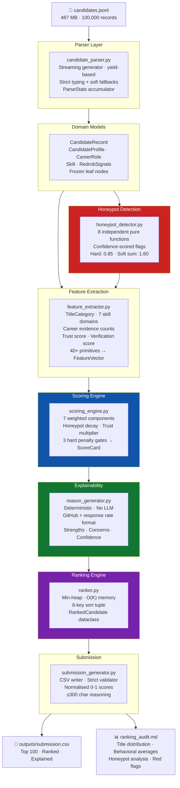
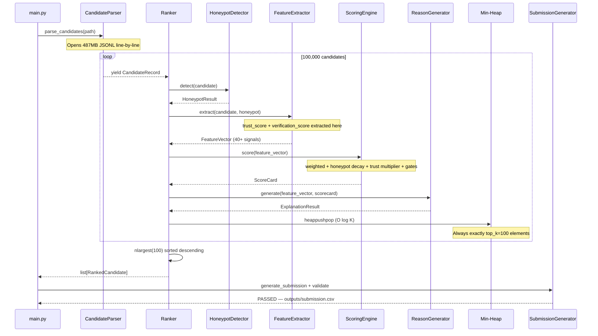
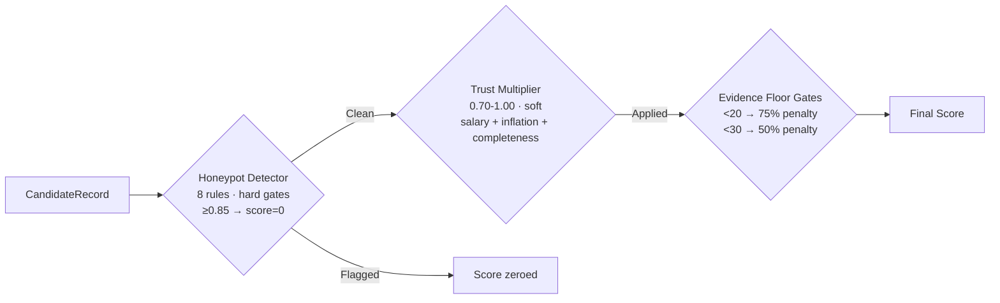
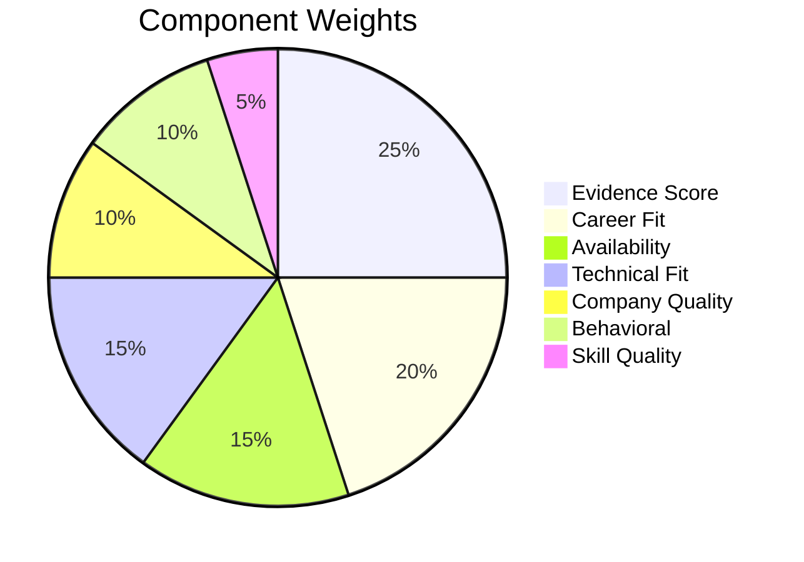
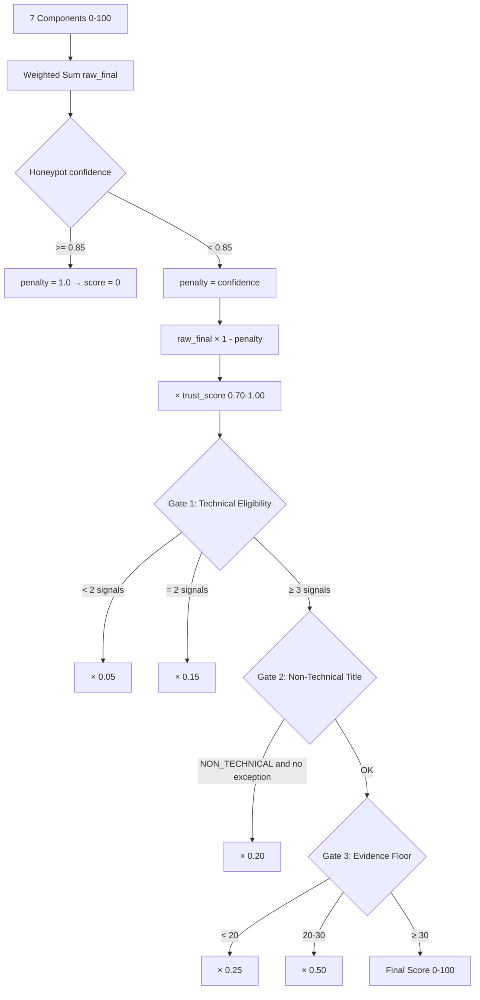
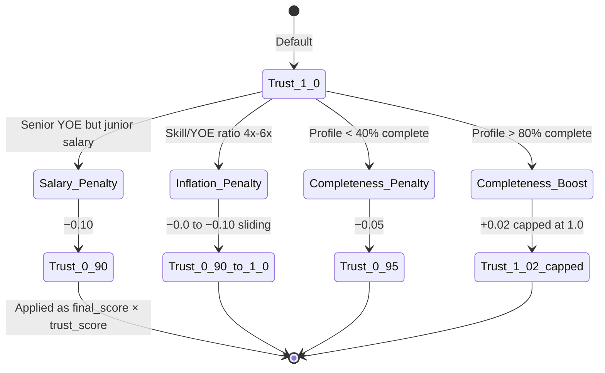

<div align="center">

# 🤖 Redrob AI Candidate Ranker

### *Ranking 100,000 Candidates for a Senior AI Engineer Role — Without a Single LLM Call*

<br/>


<br/>

> **Built for the INDIA.RUNS / Redrob Candidate Ranking Challenge.**
> Rank the Top 100 from a pool of 100,000 candidates for the role:
> **"Senior AI Engineer — Founding Team"**

</div>

---

## 📋 Table of Contents

- [Problem Statement](#-problem-statement)
- [Why Traditional Search Fails](#-why-traditional-candidate-search-fails)
- [Solution Overview](#-solution-overview)
- [Architecture](#-architecture)
- [End-to-End Pipeline](#-end-to-end-pipeline)
- [Key Innovations](#-key-innovations)
- [Feature Engineering](#-feature-engineering)
- [Scoring Methodology](#-scoring-methodology)
- [Trust Layer](#-trust-layer)
- [Explainability Layer](#-explainability-layer)
- [Performance Metrics](#-performance-metrics)
- [Folder Structure](#-folder-structure)
- [Installation](#-installation)
- [Usage](#-usage)
- [Validation](#-validation)
- [Future Improvements](#-future-improvements)

---

## 🎯 Problem Statement

The **Redrob / INDIA.RUNS AI Ranking Challenge** requires selecting **Top 100** from **100,000 synthetic candidates** for:

> **Role:** Senior AI Engineer — Founding Team
> **Signal:** Retrieval systems, vector databases, learning-to-rank, production ML at product companies
> **Constraint:** Fully offline, CPU-only, deterministic, recruiter-explainable

The dataset is adversarial by design. Non-technical profiles (Business Analysts, HR Managers, Marketing Managers) make up **~58.6%** of all candidates, most equipped with inflated AI skill tags. The challenge is separating signal from noise at scale.

---

## ❌ Why Traditional Candidate Search Fails

| Failure Mode | What Happens | Impact |
|---|---|---|
| **Keyword Stuffing** | Marketing Manager lists FAISS, RAG, Pinecone at expert level | False positives dominate shortlist |
| **Resume Inflation** | Expert proficiency claimed for 0–1 month skills | Impossible to distinguish from real expertise |
| **BA Flooding** | Business Analysts describe company ML infra, appear ML-experienced | Dilutes shortlist with non-builders |
| **Non-Technical Flooding** | 58,600+ non-technical candidates have complete AI skill sections | Overwhelms relevant signal |
| **Ghost Profiles** | Valid-looking ML profiles with 12+ months inactivity | High on paper, unavailable in practice |
| **Synthetic Honeypots** | Logically impossible profiles (677 months of skill on 6 YOE) | Designed to fool keyword-count rankers |

---

## ✅ Solution Overview

A **fully offline, CPU-only, streaming ranking pipeline** that processes all 100,000 candidates in a single pass with O(K) memory:

```
1. Streaming Parser        → never loads 487MB file; one record at a time
2. Honeypot Detector       → 8 independent rule checks; hard threshold 0.85
3. Feature Extractor       → 40+ signals: skills, evidence, company, behavioral, trust, verification
4. Scoring Engine          → 7 weighted components + trust multiplier + 3 hard penalty gates
5. Explainability Engine   → deterministic factual reasoning; no LLM
6. Min-Heap Ranker         → O(K) memory; 6-key sort tuple
7. Submission Validator    → 100 rows, sequential ranks, descending scores, ≤300 char reasoning
```

**Zero LLM calls. Zero cloud API calls. Zero GPU. Zero embeddings at runtime.**

---

## 🏗️ Architecture



---

## 🔄 End-to-End Pipeline



---

## 💡 Key Innovations

### 1. O(K) Memory Streaming

A generator-based parser streams 487MB JSONL line-by-line. A `heapq` min-heap holds exactly 100 candidates at all times. `heapq.heappushpop` is O(log 100) per candidate — the entire 100K pool costs O(100K × log 100) arithmetic, not O(100K) memory.

### 2. Three-Layer Fraud Protection



- **Layer 1 — Honeypot Detector**: Hard rule-based. 8 checks. Confidence ≥ 0.85 collapses score to zero.
- **Layer 2 — Trust Multiplier**: Soft 0.70–1.00 factor. Penalises borderline inconsistencies (salary vs YOE, 4x–6x skill inflation, sparse profiles) that don't rise to honeypot level.
- **Layer 3 — Evidence Floor Gates**: Hard percentage penalties if career description evidence is too thin (< 20 or < 30 evidence points).

### 3. Evidence-Driven Scoring

`evidence_score` (weight **25%**) counts domain keyword occurrences in `career_history.description` text using `str.count()`. Keywords are JD-specific and deliberate (`"semantic search"`, `"bm25"`, `"ndcg"`, `"learning to rank"`) — not generic words that appear in any BA project description.

### 4. ML vs. BA Disambiguation

`product_ml_experience_years` — the most important single derived feature — uses a two-tier evidence model:
- **Strong evidence** (FAISS, embedding, vector search in description): ML credit regardless of title
- **General evidence** (machine learning, PyTorch): ML credit only if role title is **not** a non-technical title

This prevents Business Analysts from accumulating ML YOE by describing their company's ML systems.

### 5. Platform-Verified Signal Layer

A `verification_score` (0–100) combines five platform-verified (not self-reported) signals:
`verified_email (+25) + verified_phone (+25) + linkedin_connected (+20) + profile_completeness (0→20) + github_linked (+10)`

This rewards candidates who have verifiable real-world presence, boosting their `skill_quality` score.

### 6. Deterministic Explainability

Every CSV row's reasoning string is factual and recruiter-verifiable:
```
"NLP Engineer with 16.1yrs; Milvus + BM25; github 74; response rate 0.73"
```
Every token is a specific value from `FeatureVector`. No LLM. No templates. No hallucinations.

---

## 🔧 Feature Engineering

### Skill Domain Counts (from `profile.skills`)

| Feature | JD Keywords Counted | Relevance |
|---|---|---|
| `retrieval_skill_count` | BM25, FAISS, Elasticsearch, OpenSearch, Semantic Search, Dense Retrieval | ⭐⭐⭐ Core |
| `ranking_skill_count` | Learning to Rank, LTR, NDCG, MRR, pointwise, pairwise, listwise | ⭐⭐⭐ Core |
| `vector_db_skill_count` | Pinecone, Milvus, Qdrant, Weaviate, pgvector, Chroma, Vespa | ⭐⭐⭐ Core |
| `recommendation_skill_count` | Collaborative filtering, two-tower, SVD, matrix factorization | ⭐⭐ Supporting |
| `llm_skill_count` | RAG, embeddings, LangChain, fine-tuning, BERT, GPT | ⭐ Supporting |
| `ml_skill_count` | MLflow, MLOps, Weights & Biases, A/B testing | ⭐ Supporting |
| `cv_skill_count` | YOLO, GAN, OpenCV, CNN, ResNet, ASR | ⚠️ Wrong domain |

### Career Evidence Counts (from `career_history.description`)

| Feature | Evidence Keywords (sample) |
|---|---|
| `retrieval_evidence_count` | `"semantic search"`, `"vector search"`, `"bm25"`, `"elasticsearch"`, `"retrieval system"` |
| `ranking_evidence_count` | `"learning to rank"`, `"rerank"`, `"ndcg"`, `"mrr"`, `"listwise"`, `"ltr model"` |
| `vector_db_evidence_count` | `"pinecone"`, `"qdrant"`, `"milvus"`, `"faiss"`, `"vector database"`, `"pgvector"` |
| `recommendation_evidence_count` | `"recommendation system"`, `"collaborative filtering"`, `"two-tower"`, `"item embedding"` |
| `ml_production_evidence_count` | `"shipped"`, `"model in production"`, `"inference pipeline"`, `"millions of queries"` |

### Behavioral Signals (from `redrob_signals` — 23 fields)

| Feature | Source | Notes |
|---|---|---|
| `recruiter_response_rate` | Direct | Dataset mean 0.44; penalised < 0.30 |
| `notice_period_days` | Direct | Dataset median 90d; ideal < 30d |
| `github_activity_score` | Direct | -1 = not linked (sentinel); shown in reasoning when ≥ 60 |
| `days_since_active` | `last_active_date` → today | > 180d: -15 behavioral pts; > 365d: -30 pts |
| `interview_completion_rate` | Direct | Reliability signal |
| `open_to_work` | `open_to_work_flag` | Boolean multiplier |

### Trust Signals (computed by `_extract_trust`)

| Check | Condition | Penalty |
|---|---|---|
| Salary vs YOE | Senior (≥5 YOE) expecting < 8 LPA | −0.10 |
| Salary vs YOE | Junior (< 2 YOE) expecting > 40 LPA | −0.08 |
| Skill inflation (borderline) | Total skill months = 4x–6x YOE months | −0.0 to −0.10 (sliding) |
| Sparse profile | `profile_completeness_score` < 40% | −0.05 |
| Well-maintained | `profile_completeness_score` > 80% | +0.02 |

### Verification Signals (computed by `_extract_verification`)

| Signal | Points | Verified by |
|---|---|---|
| `verified_email` | +25 | Redrob platform |
| `verified_phone` | +25 | Redrob platform |
| `linkedin_connected` | +20 | OAuth connection |
| `profile_completeness_score` (0→20) | up to +20 | Platform computed |
| `github_activity_score` linked | +10 | GitHub API |
| **Total** | **100** | |

---

## 🎯 Scoring Methodology



| Component | Weight | Formula |
|---|---|---|
| **Evidence Score** | 25% | `retrieval×5 + ranking×5 + recommendation×3 + vector_db×3 + ml_production×4` → capped at 30pts = 100% |
| **Career Fit** | 20% | Base 50 + YOE 5–9yr bonus (+20) + `product_ml_yoe × 7` (max +35) + `technical_role_ratio × 10` |
| **Availability** | 15% | 100 − notice penalty (≤30d: 0, ≤60d: −10, ≤90d: −30, >90d: −60) − response_time>72h: −20 |
| **Technical Fit** | 15% | `retrieval×4 + ranking×4 + vector_db×3 + recommendation×2 + llm×1 + ml×0.5` → capped at 25pts = 100% |
| **Company Quality** | 10% | `product_ratio × 60 + min(product_count × 20, 40)` |
| **Behavioral** | 10% | `open_to_work×30 + response_rate×30 + interview_rate×20 + github×20` − inactivity decay |
| **Skill Quality** | 5% | `expert×10 (max 40) + advanced×2 (max 20) + duration/36×20 + assessment×10 + verification×0.10 (max 10)` |

### Score Computation Order



---

## 🔐 Trust Layer

The trust layer sits between honeypot detection and the hard penalty gates. It applies a **soft multiplicative penalty** (0.70–1.00) to catch borderline cases:



**Verification Score** (0–100) feeds into `skill_quality` as a +10pt boost at maximum:

| `verification_score` | Boost to `skill_quality` |
|---|---|
| 100 | +10.0 pts |
| 70 | +7.0 pts |
| 50 | +5.0 pts |
| 0 | +0.0 pts |

---

## 💬 Explainability Layer

### Reasoning Text Format

```
{title} with {X.X}yrs; {domain}; [github {score};] {signal}[; concern]
```

**Segment order:**
1. **Identity**: `AI Engineer with 6.3yrs`
2. **Domain**: named skill names from profile (`FAISS + Semantic Search`)
3. **GitHub** *(conditional)*: `github 74` — only when `github_activity_score ≥ 60`
4. **Signal**: concern-first (`notice 120d` / `inactive 8mo`), then `response rate 0.74`
5. **Concern** *(conditional)*: `limited retrieval evidence` / `below preferred threshold`

### Live Examples (from `outputs/submission.csv`)

| Rank | Reasoning Text |
|---|---|
| #1 | `AI Engineer with 16.9yrs; Information Retrieval + FAISS; response rate 0.72` |
| #3 | `NLP Engineer with 16.1yrs; Milvus + BM25; github 74; response rate 0.73` |
| #7 | `AI Research Engineer with 6.3yrs; Semantic Search + OpenSearch; response rate 0.79` |
| #18 | `AI Research Engineer with 6.7yrs; FAISS + Learning to Rank; notice 120d` |

---

## ⚡ Performance Metrics

| Metric | Value |
|---|---|
| Candidates Processed | 100,000 |
| Input File Size | ~487 MB JSONL |
| Peak RAM | O(K) — 100-element heap + single record |
| GPU Required | None |
| LLM Calls | Zero |
| Honeypots in Top 100 | **Zero** (0.0% confidence > 0.5) |
| Top 100 Product Company Coverage | **100%** |
| NON_TECHNICAL titles in Top 100 | **Zero** |
| MANAGER titles in Top 100 | **Zero** |
| Avg. Recruiter Response Rate | **59.28%** |
| Avg. GitHub Activity Score | **48.54** (of linked profiles) |
| Avg. Notice Period | **73.0 days** |
| Avg. Interview Completion Rate | **72.79%** |

---

## 📁 Folder Structure

```
redrob-ai-ranker/
├── main.py                          # Pipeline entry point
├── audit.py                         # Top-100 audit → ranking_audit.md
├── requirements.txt                 # Python deps (sentence-transformers, faiss-cpu, etc.)
├── ranking_audit.md                 # Auto-generated audit report
│
├── config/
│   └── settings.py                  # Single source of truth: weights, thresholds, config
│
├── src/
│   ├── models/candidate.py          # Typed domain models (frozen leaf dataclasses)
│   ├── parser/candidate_parser.py   # Streaming generator + ParseStats
│   ├── scoring/
│   │   ├── honeypot_detector.py     # 8 flags · HoneypotResult
│   │   ├── feature_extractor.py     # FeatureVector (40+ signals) · trust · verification
│   │   └── scoring_engine.py        # 7 components · trust multiplier · 3 gates · ScoreCard
│   ├── explainability/
│   │   └── reason_generator.py      # Deterministic reasoning · ExplanationResult
│   ├── ranking/ranker.py            # Min-heap Top-K · RankedCandidate
│   └── submission/submission_generator.py  # CSV writer + strict validator
│
├── tests/
│   ├── test_honeypot_detector.py    # Per-flag unit tests
│   ├── test_feature_extractor.py    # Feature extraction unit tests
│   ├── test_scoring_engine.py       # Scoring unit tests
│   ├── test_reason_generator.py     # Reasoning unit tests
│   ├── test_ranker.py               # Heap + sort unit tests
│   └── test_submission_generator.py # CSV validation unit tests
│
├── outputs/
│   ├── submission.csv               # Final 100-row ranked output
│   └── dataset_profile.md           # EDA output: distributions, anomalies
│
└── docs/
    ├── architecture.md              # Deep technical architecture
    ├── data_profile_report.md       # Dataset analysis
    ├── feature_catalog.md           # All 40+ features documented
    ├── jd_analysis.md               # JD requirements mapped to features
    ├── ranking_analysis.md          # Scoring methodology explained
    └── ranking_diagnostics.md       # Evolution, corrections, lessons learned
```

---

## 🚀 Installation

```bash
git clone https://github.com/your-org/redrob-ai-ranker.git
cd redrob-ai-ranker
python -m venv .venv
.venv\Scripts\activate          # Windows
# source .venv/bin/activate     # macOS/Linux
pip install -r requirements.txt
# CPU-only PyTorch:
pip install torch --index-url https://download.pytorch.org/whl/cpu
```

Place the dataset at:
```
data/[PUB] India_runs_data_and_ai_challenge/India_runs_data_and_ai_challenge/candidates.jsonl
```

---

## ▶️ Usage

```bash
# Full pipeline: parse → score → rank → validate → output
python main.py

# Audit the top 100 results
python audit.py

# Run tests
python -m pytest tests/ -v
```

---

## ✅ Validation

The `SubmissionGenerator.validate_submission()` enforces at runtime:
- Exactly 100 rows
- Headers: `candidate_id, rank, score, reasoning`
- Unique candidate IDs
- Sequential ranks 1–100
- Monotonically descending scores
- Non-empty reasoning ≤ 300 characters

`audit.py` generates `ranking_audit.md` with post-hoc human review:
- Title/category distribution
- Honeypot analysis
- Behavioral averages
- Red flag identification

---

## 🔭 Future Improvements

| Improvement | Notes |
|---|---|
| **Semantic Retrieval** | `all-MiniLM-L6-v2` is already in `requirements.txt`; `EmbeddingConfig` ready in `settings.py` |
| **FAISS ANN Index** | `faiss-cpu` already a dependency; use for sub-second pre-filtering |
| **LTR Model** | Train LambdaMART on recruiter feedback over the `FeatureVector` |
| **Temporal Role Weighting** | Recent roles should outweigh older ones in evidence scoring |
| **Trust Score Calibration** | Salary sanity thresholds should be tuned against ground truth data |

---

<div align="center">

*Made for INDIA.RUNS × Redrob Hackathon · June 2026*

</div>
