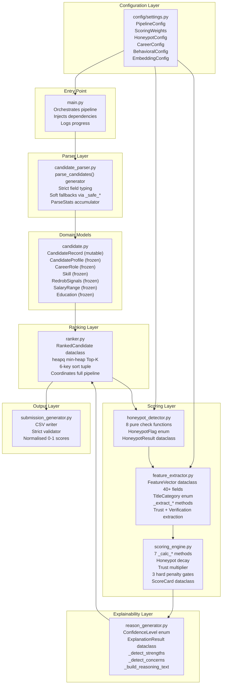
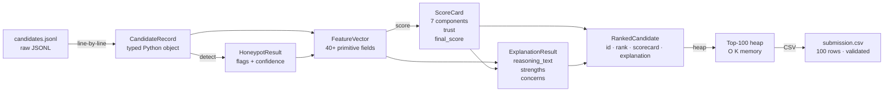
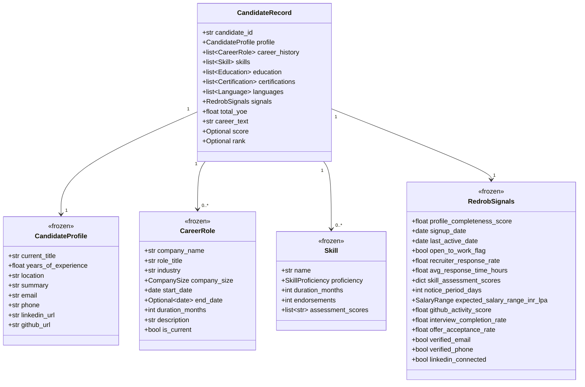
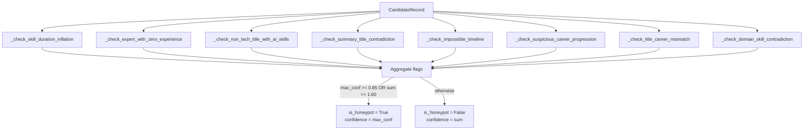
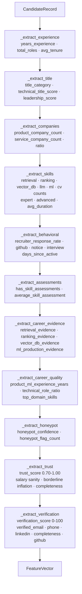

# Technical Architecture — Redrob AI Candidate Ranker

> Deep-dive into module responsibilities, data flow, component interactions, and design rationale.

---

## 1. System Overview

The pipeline is a **stateless, streaming, single-pass ranker** that processes 100,000 JSONL records without loading them simultaneously into memory. Its architecture enforces three principles:

1. **Separation of concerns** — each module has exactly one responsibility
2. **Immutability of domain models** — leaf nodes are `frozen=True` dataclasses
3. **O(K) memory bound** — the min-heap is the only data structure that grows with candidates, and it is bounded to `top_k=100`

---

## 2. Component Diagram



---

## 3. Data Flow



---

## 4. Module Descriptions

### `config/settings.py`

Single source of truth for all numeric constants. Uses frozen `@dataclass` with a `validate()` method that asserts `sum(weights) == 1.0` at import time, preventing accidental weight drift.

| Config Class | Purpose |
|---|---|
| `PipelineConfig` | `top_k`, `log_every`, dataset path defaults |
| `ScoringWeights` | 7 component weights (frozen, validated to sum=1.0) |
| `HoneypotConfig` | `hard_threshold=0.85`, `soft_sum_threshold=1.60` |
| `CareerConfig` | Product company names list, service company names list, industry classifications |
| `BehavioralConfig` | Notice period tier thresholds, inactivity thresholds |
| `EmbeddingConfig` | `model_name`, `embedding_dim`, `batch_size` (for future semantic retrieval) |

---

### `src/models/candidate.py`

All domain types. Leaf-node dataclasses are `frozen=True` to prevent mutation during the single-pass extraction:



---

### `src/parser/candidate_parser.py`

A Python **generator** (`yield`-based) that reads the JSONL file one line at a time. Never holds more than one `CandidateRecord` in memory simultaneously.

Key design decisions:
- **Soft fallbacks** via `_safe_int`, `_safe_float`, `_safe_date` wrap every JSON field access — a malformed line is silently skipped and counted in `ParseStats`, not raising an exception
- `career_text` is pre-computed as a concatenation of all `role.description` fields — this is the string that `FeatureExtractor` counts evidence keywords against
- `total_yoe` is pre-computed from `profile.years_of_experience` with an additional cross-check against career history dates

---

### `src/scoring/honeypot_detector.py`

Eight independent **pure functions** (no shared state, no side effects). Each takes a `CandidateRecord` and returns zero or more `(HoneypotFlag, confidence, reason)` tuples.



**Decision rule** (from `config.settings.HoneypotConfig`):
```python
is_honeypot = (max_conf >= 0.85) or (sum_conf >= 1.60)
confidence  = max(max_conf, min(sum_conf, 1.0))
```

---

### `src/scoring/feature_extractor.py`

Converts a `CandidateRecord` + `HoneypotResult` into a flat `FeatureVector` of 40+ primitive-typed fields. The `ScoringEngine` must never read from `CandidateRecord` directly — all data access goes through `FeatureVector`.

Extraction runs in 11 named groups in this order:



---

### `src/scoring/scoring_engine.py`

Stateless scoring against `FeatureVector`. Produces a `ScoreCard` with the full breakdown.

**Score computation order (5 steps):**

1. Compute 7 independent component scores (0–100 each)
2. Weighted combination → `raw_final`
3. Honeypot decay → `raw_final × (1 − honeypot_penalty)`
4. Trust multiplier → `× trust_score (0.70–1.00)`
5. Hard penalty gates (Gates 1–3) → conditional multiplications

---

### `src/explainability/reason_generator.py`

Generates deterministic, factual reasoning — no LLM, no templates, no hallucinations. Every token in the output is a specific value from `FeatureVector`.

**Reasoning text format:**
```
{title} with {X.X}yrs; {domain}; [github {N};] {signal}[; concern]
```

**`top_domain_skills`** is the key field enabling named technology references. It is populated by `_extract_career_quality` as the top-3 JD-relevant skills (sorted by proficiency level: expert > advanced > intermediate) from the candidate's actual `profile.skills` list.

---

### `src/ranking/ranker.py`

Coordinates the full pipeline and maintains the Top-K heap.

**Sort tuple (6 keys, descending):**
```python
sort_key = (
    scorecard.final_score,              # primary sort
    scorecard.evidence_score,           # tiebreaker 1
    scorecard.technical_fit_score,      # tiebreaker 2
    features.product_ml_experience_years, # tiebreaker 3
    features.recruiter_response_rate,   # tiebreaker 4
    candidate.candidate_id,             # ultimate tiebreaker (deterministic)
)
```

`heapq.heappushpop` is called on every candidate when the heap is at capacity (K=100), evicting the weakest candidate in O(log K) time.

---

### `src/submission/submission_generator.py`

Two static methods:

- `generate_submission()` — writes CSV with columns `candidate_id, rank, score, reasoning`. Score is normalised to 0–1 by dividing the internal 0–100 score by 100.
- `validate_submission()` — enforces the submission contract:
  - Exactly 100 rows
  - Correct headers
  - Unique `candidate_id` values
  - Sequential ranks 1–100
  - Monotonically descending scores
  - Non-empty reasoning ≤ 300 chars

---

## 5. Ranking Pipeline Sequence

```mermaid
sequenceDiagram
    participant M as main.py
    participant P as Parser
    participant R as Ranker
    participant HP as Honeypot
    participant FE as FeatureExtractor
    participant SE as ScoringEngine
    participant RG as ReasonGenerator
    participant H as Min-Heap

    M->>P: parse_candidates(path)
    loop 100,000 iterations
        P-->>R: CandidateRecord
        R->>HP: detect(candidate)
        HP-->>R: HoneypotResult
        R->>FE: extract(candidate, honeypot)
        Note over FE: Runs 11 extraction groups<br/>Returns flat FeatureVector
        FE-->>R: FeatureVector
        R->>SE: score(feature_vector)
        Note over SE: 7 components → weighted<br/>→ honeypot decay<br/>→ trust multiplier<br/>→ 3 gates
        SE-->>R: ScoreCard
        R->>RG: generate(fv, sc)
        Note over RG: Factual text: title+yrs;<br/>domain; github N; signal
        RG-->>R: ExplanationResult
        R->>H: heappushpop (evict weakest)
    end

    R->>R: nlargest(100)
    R-->>M: list[RankedCandidate]
```

---

## 6. Memory Profile

| Structure | Size | Lifetime |
|---|---|---|
| JSONL line buffer | ~2KB per line | One iteration |
| `CandidateRecord` | ~8KB per record | One iteration |
| `FeatureVector` | ~400 bytes | One iteration |
| `ScoreCard` | ~300 bytes | One iteration |
| Min-heap | 100 entries × ~700 bytes = ~70KB | Entire pipeline run |
| `submission.csv` | ~12KB | Written once at end |

**Peak RAM:** approximately `70KB (heap) + 10KB (current record) + OS overhead` — well within any machine's working memory.

---

## 7. Design Decisions

| Decision | Rationale |
|---|---|
| Streaming generator | 487MB file; never load all 100K records simultaneously |
| Frozen leaf dataclasses | Prevent mutation during single-pass extraction across 100K records |
| Evidence > Technical Fit weight | Career text requires deliberate writing; skill list is trivially padded |
| Trust multiplier after honeypot | Honeypot handles hard cases; trust handles borderline cases softly |
| Deterministic reasoning | LLMs hallucinate; recruiters act on stated facts — every claim must be verifiable |
| 6-key sort tuple | Deterministic tie-breaking prevents non-deterministic output across runs |
| `assert sum(weights) == 1.0` at import | Catches accidental weight drift at startup, not at runtime |
