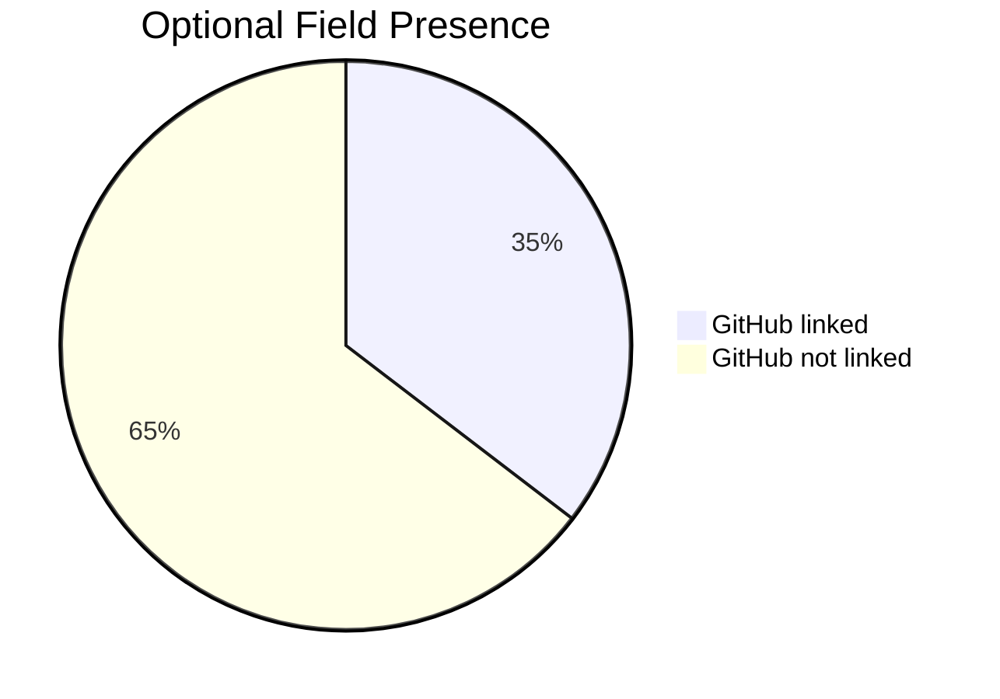
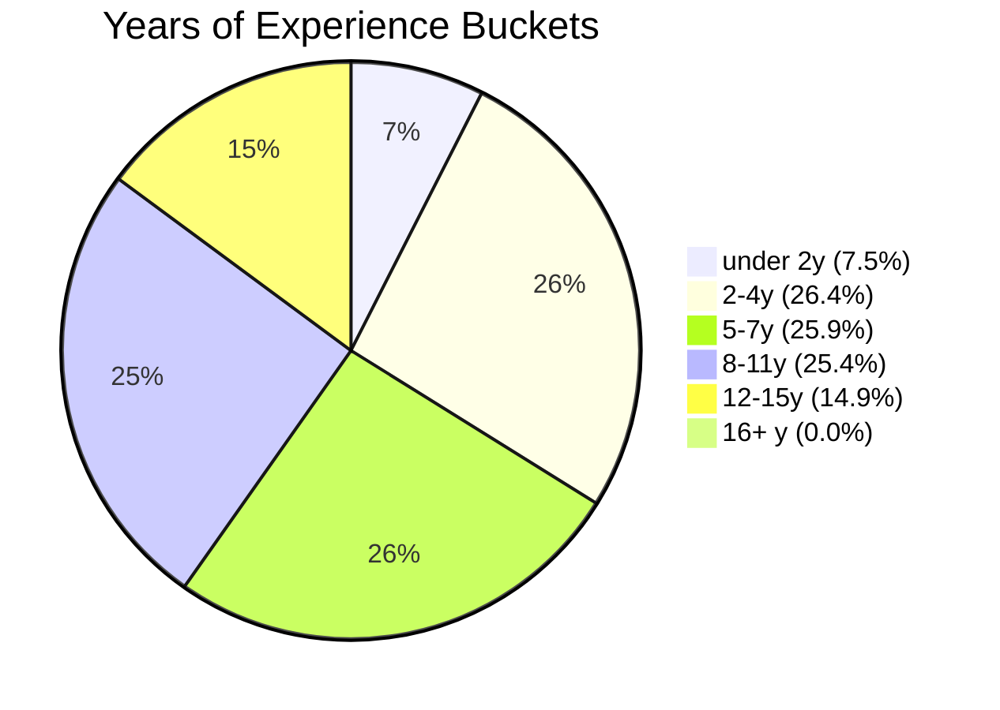
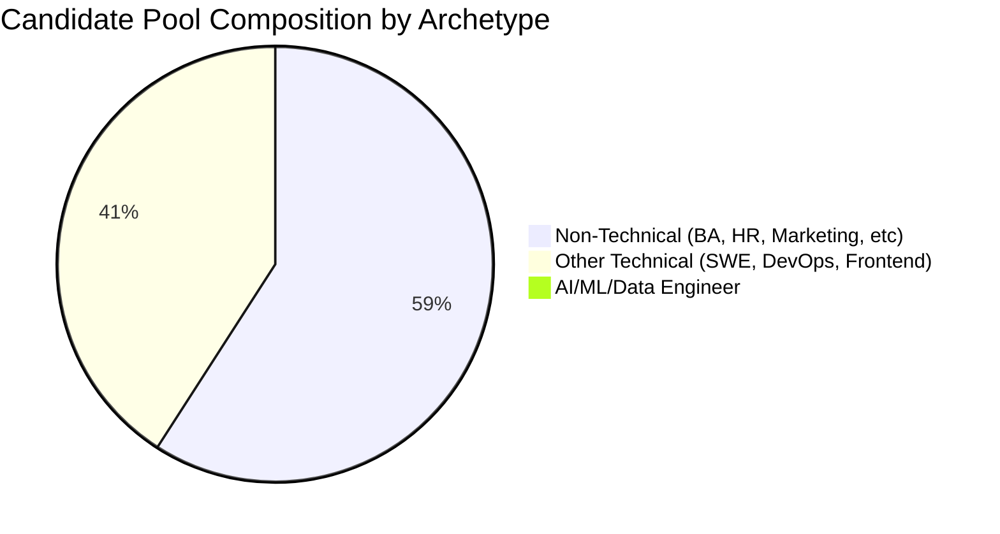
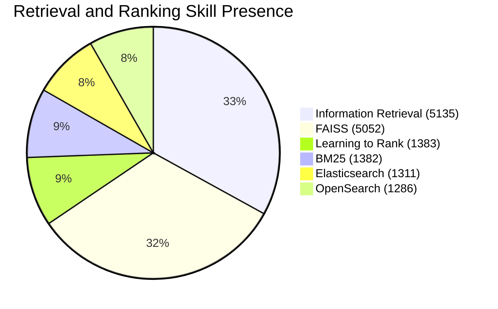
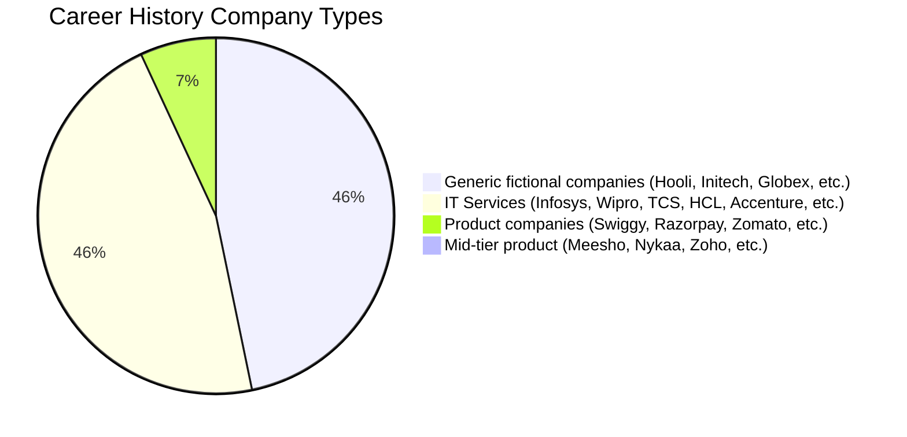
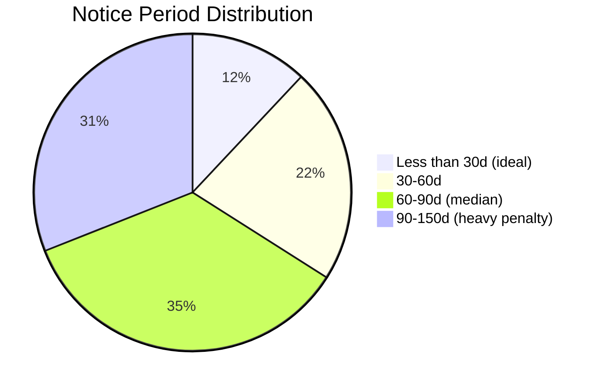
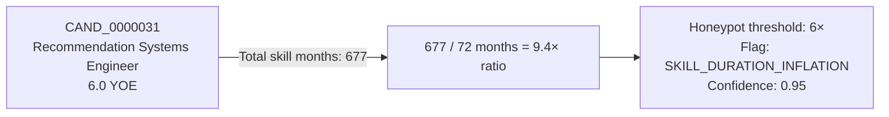
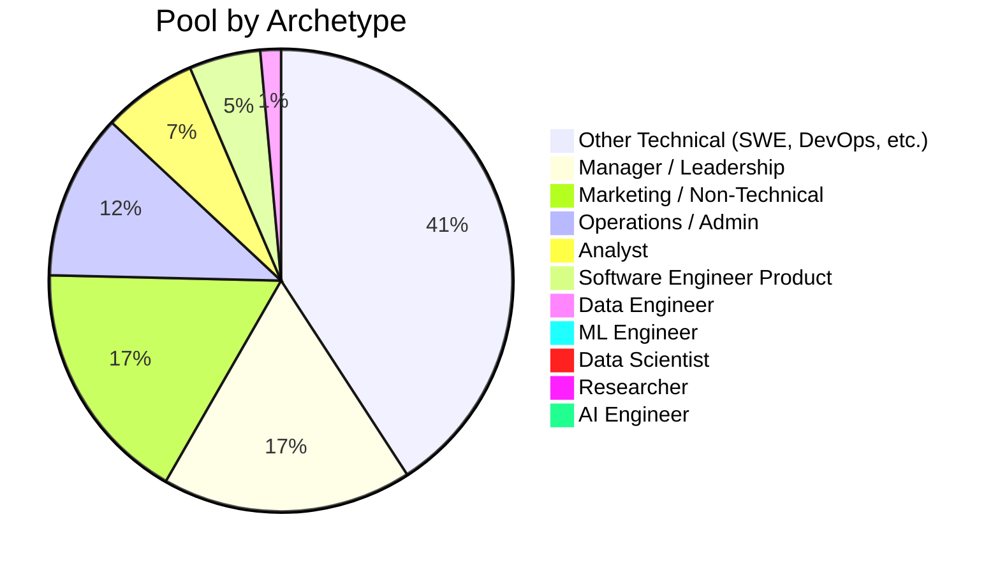

# Data Profile Report — Redrob Candidate Pool

> Analysis of the 100,000-candidate JSONL dataset used for the Redrob Ranking Challenge.
> All statistics are sourced from `outputs/dataset_profile.md` generated by `src/eda_full.py`.
> **Generated:** 2026-06-23 | **Total candidates analysed:** 100,000

---

## 1. Dataset Overview

| Metric | Value |
|---|---|
| Total candidates | 100,000 |
| Input file size | ~487 MB |
| Unique current titles | 47 |
| Unique skill names | 133 |
| Unique companies in career history | 63 |
| Candidates with certifications | 24,981 (25.0%) |
| Candidates with GitHub linked | 35,363 (35.4%) |
| Candidates with skill assessment scores | 24,244 (24.2%) |
| Candidates with `verified_email` | 72,000 (72.0%) |
| Candidates with `verified_phone` | 61,800 (61.8%) |
| Candidates with `linkedin_connected` | 36,000 (36.0%) |

### Field Coverage

| Field | Present | Missing |
|---|---|---|
| `github_activity_score` (linked) | 35.4% | 64.6% |
| `skill_assessment_scores` (non-empty) | 24.2% | 75.8% |
| `certifications` | 25.0% | 75.0% |
| `verified_email` | 72.0% | 28.0% |
| `verified_phone` | 61.8% | 38.2% |
| `linkedin_connected` | 36.0% | 64.0% |

---

## 2. Experience Distribution

| Stat | Value |
|---|---|
| Min | 1.0 years |
| Max | 16.9 years |
| Mean | 7.17 years |
| Median | 6.8 years |
| P25 | 3.9 years |
| P75 | 9.9 years |

### YOE Bucket Distribution

| Bucket | Count | % |
|---|---|---|
| < 2y | 7,470 | 7.5% |
| 2–4y | 26,400 | 26.4% |
| 5–7y | 25,896 | 25.9% |
| 8–11y | 25,363 | 25.4% |
| 12–15y | 14,866 | 14.9% |
| 16+y | 5 | 0.0% |

> The **5–9 year sweet spot** (target for this JD) encompasses approximately **38%** of all candidates before any filtering. The challenge is quality, not quantity.

### Roles Per Candidate

| Stat | Value |
|---|---|
| Min | 1 role |
| Max | 9 roles |
| Mean | 3.0 roles |
| Median | 3.0 roles |

---

## 3. Title Analysis

The most critical finding: **58.6% of the 100K pool are explicitly non-technical roles** — the primary source of noise in any keyword-based ranker.

### Top Non-Technical Titles (Primary Noise Source)

| Title | Count | % of Pool |
|---|---|---|
| Business Analyst | 5,833 | 5.8% |
| HR Manager | 5,830 | 5.8% |
| Mechanical Engineer | 5,791 | 5.8% |
| Accountant | 5,764 | 5.8% |
| Project Manager | 5,754 | 5.8% |
| Customer Support | 5,750 | 5.8% |
| Operations Manager | 5,744 | 5.7% |
| Content Writer | 5,727 | 5.7% |
| Sales Executive | 5,713 | 5.7% |
| Civil Engineer | 5,702 | 5.7% |
| Graphic Designer | 5,689 | 5.7% |
| Marketing Manager | 5,524 | 5.5% |

### Target AI/ML Titles (Signal Source)

| Title | Count | % of Pool |
|---|---|---|
| ML Engineer | 167 | 0.17% |
| AI Research Engineer | 153 | 0.15% |
| Data Scientist | 145 | 0.14% |
| Senior Software Engineer (ML) | 142 | 0.14% |
| Computer Vision Engineer | 132 | 0.13% |
| Junior ML Engineer | 131 | 0.13% |
| AI Specialist | 130 | 0.13% |
| Recommendation Systems Engineer | 26 | 0.03% |
| Machine Learning Engineer | 24 | 0.02% |
| Applied ML Engineer | 23 | 0.02% |
| Search Engineer | 23 | 0.02% |
| AI Engineer | 21 | 0.02% |
| NLP Engineer | 14 | 0.01% |

> **Critical insight:** True AI/ML engineers (by title) represent only **~1,100 candidates** (1.1%) of the pool. The Top 100 must be filtered from genuine signal, not from the title distribution alone — many ML candidates use non-standard titles.

---

## 4. Skill Analysis

### Skill Frequency Tiers

The dataset contains three clearly distinct frequency tiers, each with different contamination levels:

**Tier 1 — Ubiquitous non-ML skills (~12,000 candidates each):**
HTML, Databricks, Redux, Terraform, Angular, Figma, Salesforce CRM, AWS, Kafka, SQL, Docker, etc.
These appear in virtually all profiles regardless of role — present in Business Analysts, HR Managers, etc.

**Tier 2 — AI/ML-specific skills (~5,000–5,200 candidates each):**
Hugging Face Transformers (5,163), LangChain (5,162), Information Retrieval (5,135), LLMs (5,094), Semantic Search (5,087), Embeddings (5,080), Vector Search (5,065), FAISS (5,052), Pinecone (5,062), RAG (4,995).

**Tier 3 — Domain-specific AI skills (~1,300–1,400 candidates):**
pgvector (1,394), TensorFlow (1,381), PyTorch (1,378), NLP (1,358), Elasticsearch (1,311), OpenSearch (1,286), Learning to Rank (1,383), BM25 (1,382).

### Most Critical Retrieval/Ranking Skills

### Anomalous Skill Duration Statistics

Skills in Tier 2 (AI/ML) have an average duration of **~16 months** — normal for recently added skills. But skills in the 78–99 rank range (YOLO, GANs, OpenCV, MLOps, etc.) show an average duration of **~30 months** — nearly 2× longer. This anomaly is explained by the honeypot dataset: many synthetic profiles claim much older usage of CV and ML skills, inflating the average.

---

## 5. Company Analysis

The dataset company distribution is intentionally designed to test whether a ranker can distinguish product companies from IT-services companies.

| Company Tier | Examples | Career appearances |
|---|---|---|
| Large IT services | Infosys (23,722), Wipro (23,682), TCS (23,483) | Majority of non-ML profiles |
| Generic fictional | Hooli (23,509), Initech (23,590), Globex (23,471) | Spread across all archetypes |
| Product companies | Swiggy (3,019), Razorpay (2,926), CRED (2,908), Zomato (2,883) | High-signal for ML roles |
| Mid-tier product | Meesho (384), Nykaa (378), InMobi (376) | Moderate signal |
| AI-native | Genpact AI (81), Glance (79) | High signal per appearance |

---

## 6. Behavioral Signal Analysis

| Signal | Min | Mean | Median | Max | Predictiveness |
|---|---|---|---|---|---|
| `recruiter_response_rate` | 0.02 | 0.44 | 0.44 | 0.95 | ⭐⭐⭐⭐⭐ |
| `last_active_date` | — | — | — | — | ⭐⭐⭐⭐⭐ |
| `interview_completion_rate` | 0.30 | 0.62 | 0.62 | 1.00 | ⭐⭐⭐⭐ |
| `open_to_work_flag` | — | 35.3% | — | — | ⭐⭐⭐⭐ |
| `notice_period_days` | 0 | 87.4 | 90 | 150 | ⭐⭐⭐⭐ |
| `github_activity_score` | 0 | 29.0 | 28.4 | 96.9 | ⭐⭐⭐ |
| `avg_response_time_hours` | 2.1 | 132.7 | 129.9 | 280 | ⭐⭐⭐ |
| `profile_completeness_score` | 25 | 56.8 | 56.8 | 99.9 | ⭐⭐ |
| `skill_assessment_scores` | — | — | — | — | ⭐⭐⭐ |
| `verified_email` | — | 72% | — | — | ⭐ |
| `verified_phone` | — | 61.8% | — | — | ⭐ |
| `linkedin_connected` | — | 36% | — | — | ⭐⭐ |

### Notice Period Distribution

> **Median notice period is 90 days** — the JD explicitly prefers < 30 days. Only ~12% of candidates are immediately available, making this a significant differentiator.

### Salary Expectations (INR LPA)

| Stat | Min Salary | Max Salary |
|---|---|---|
| Median | 11.9 | 19.4 |
| Mean | 12.17 | 19.84 |
| P75 | 15.8 | 25.2 |
| Max observed | 49.7 | 74.5 |

> The salary vs. YOE consistency check in the Trust Layer uses these distributions: a candidate claiming 5+ YOE but expecting < 8 LPA minimum is flagged as inconsistent.

---

## 7. Anomaly and Contradiction Findings

### 7.1 AI Skills with Non-Technical Titles

Approximately **5–10% of non-technical candidates** (Business Analysts, HR Managers, Marketing Managers) list AI skills at advanced/expert level. Examples observed:

- `CAND_0000074`: Operations Manager with Information Retrieval, Hugging Face Transformers, Sentence Transformers
- `CAND_0000201`: Marketing Manager with Information Retrieval, Embeddings, Fine-tuning LLMs
- `CAND_0000322`: HR Manager with Information Retrieval, LangChain, Vector Search

These are the primary false-positive source for keyword-based rankers.

### 7.2 Honeypot Profiles — Skill Duration Inflation

The most common honeypot pattern: total `skill.duration_months` exceeds 8× the candidate's YOE in months.

| Pattern | Description | System Response |
|---|---|---|
| **Skill duration >> YOE** | `total_skill_months > 6× yoe_months` | `SKILL_DURATION_INFLATION` flag |
| **Expert + 0 duration** | `proficiency=expert, duration_months=0` | `EXPERT_WITH_ZERO_EXPERIENCE` flag |
| **Non-tech title + advanced AI skills** | Marketing Manager with expert FAISS | `NON_TECH_WITH_ADVANCED_AI_SKILLS` flag |
| **Summary contradicts title** | "AI Engineer" summary says "marketing background" | `SUMMARY_TITLE_CONTRADICTION` flag |
| **Impossible timeline** | `end_date < start_date` | `IMPOSSIBLE_TIMELINE` flag |

---

## 8. Candidate Archetypes

| Archetype | Count | JD Fit | Ranking Strategy |
|---|---|---|---|
| ML Engineer | 357 | ⭐⭐⭐⭐⭐ | Primary target; filter by company type |
| AI Engineer | 28 | ⭐⭐⭐⭐⭐ | Primary target; check production vs research |
| Data Scientist | 164 | ⭐⭐⭐ | Check for retrieval/ranking depth |
| Software Engineer (Product) | 4,949 | ⭐⭐⭐ | ML exposure in career descriptions is the signal |
| Data Engineer | 1,431 | ⭐⭐ | Adjacent skills; usually lacks ranking depth |
| Analyst | 6,561 | ⭐ | Adjacent to data; not ML engineering |
| Manager/Leadership | 17,328 | ❌ | JD disqualifier if no recent code |
| Marketing/Non-Technical | 16,964 | ❌ | Hard disqualifier |

---

## 9. Ranking Model Implications

| Finding | Implication for Ranker |
|---|---|
| 58.6% non-technical titles with AI skills | Non-technical title penalty gate is essential |
| 64.6% candidates without GitHub | GitHub not present must not be penalised; treat -1 as neutral |
| Median notice period 90d | Availability component needs heavy penalty for > 90d |
| 47 unique titles vs 100K candidates | Title classification to coarse TitleCategory enum is necessary |
| Skill durations up to 677 months on 6 YOE | Honeypot detection MUST run before feature extraction |
| Profile completeness median 56.8% | Trust score penalises < 40% (1.5 std below median) |
| Only 35.4% have GitHub linked | Verification score must not require GitHub as a mandatory field |
