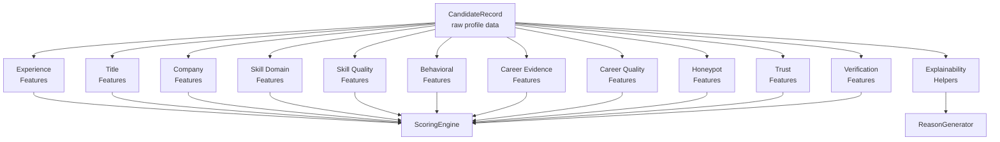
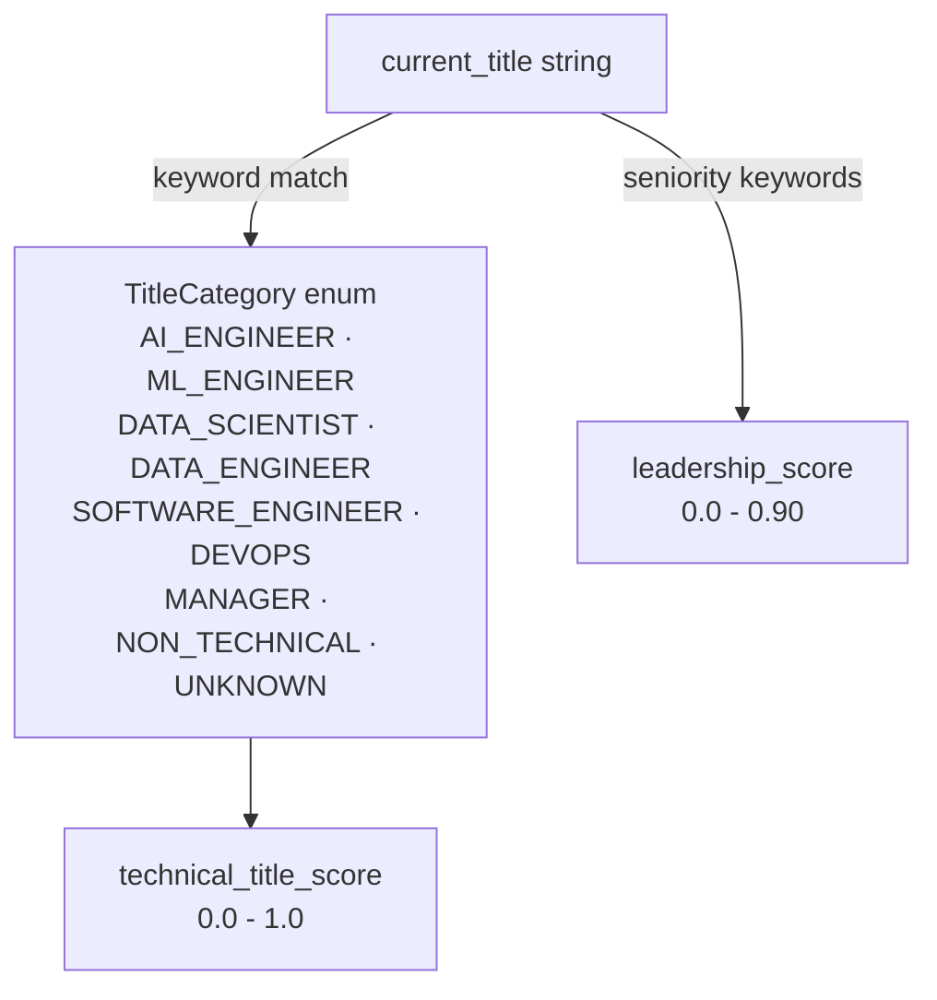
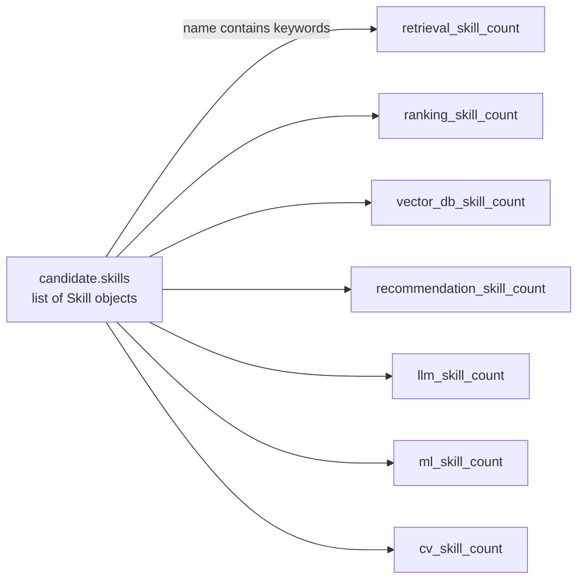
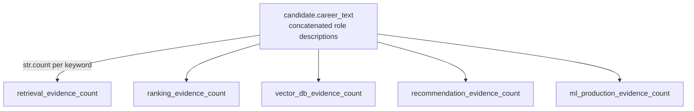
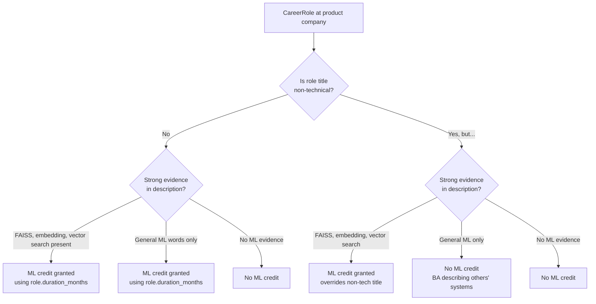
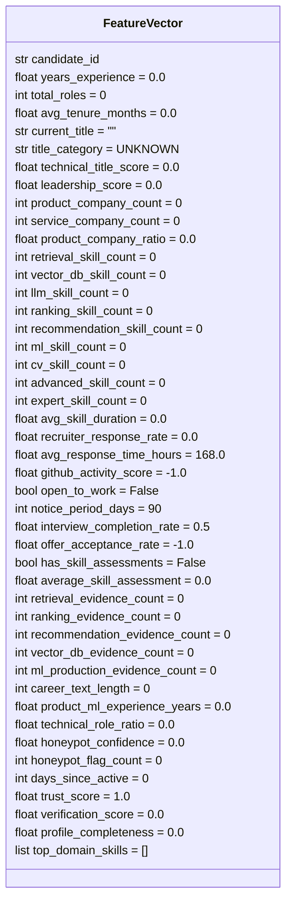

# Feature Catalog — Redrob AI Candidate Ranker

> Complete documentation of every feature extracted by `src/scoring/feature_extractor.py`.
> All features are stored in the `FeatureVector` dataclass and consumed exclusively by `ScoringEngine`.

---

## Feature Relationship Overview



---

## Category 1 — Experience Features

Extracted by `_extract_experience()` from `candidate.total_yoe` and `candidate.career_history`.

| Feature | Type | Default | Description | Scoring Use |
|---|---|---|---|---|
| `years_experience` | float | 0.0 | Total years of professional experience from `profile.years_of_experience` | Career Fit: sweet spot bonus (5–9yr +20pts), penalty for < 2yr or > 15yr |
| `total_roles` | int | 0 | Number of roles in `career_history` | Used to compute avg_tenure; denominator for ratio calculations |
| `avg_tenure_months` | float | 0.0 | `sum(role.duration_months) / total_roles` | Career Fit: job-hopper penalty if < 18mo average and > 1 role |

---

## Category 2 — Title Features

Extracted by `_extract_title()` using keyword matching against `profile.current_title`.



| Feature | Type | Default | Description | Values |
|---|---|---|---|---|
| `current_title` | str | `""` | Raw `profile.current_title` — used directly in reasoning text | — |
| `title_category` | str | `UNKNOWN` | Coarse classification via `TitleCategory` enum | AI_ENGINEER, ML_ENGINEER, DATA_SCIENTIST, DATA_ENGINEER, SOFTWARE_ENGINEER, DEVOPS, MANAGER, NON_TECHNICAL, UNKNOWN |
| `technical_title_score` | float | 0.0 | Continuous 0–1 technical relevance score | AI_ENGINEER=1.0, ML_ENGINEER=0.95, DATA_SCIENTIST=0.75, DATA_ENGINEER=0.60, SOFTWARE_ENGINEER=0.50, DEVOPS=0.30, MANAGER=0.05, NON_TECHNICAL=0.0 |
| `leadership_score` | float | 0.0 | Seniority signal from title keywords | Staff/Principal=0.90, Senior=0.70, Lead=0.60, Jr/Junior=0.20, otherwise 0.40 |

**Title Category Mapping (implemented in `TitleCategory` enum):**

| Category | Example Titles |
|---|---|
| AI_ENGINEER | AI Engineer, AI Specialist, AI Research Engineer, Lead AI Engineer |
| ML_ENGINEER | ML Engineer, Machine Learning Engineer, Applied ML Engineer, Junior ML Engineer |
| DATA_SCIENTIST | Data Scientist, Senior Data Scientist, Applied Scientist, Senior Applied Scientist |
| DATA_ENGINEER | Data Engineer, Senior Data Engineer, Analytics Engineer |
| SOFTWARE_ENGINEER | Software Engineer, Senior Software Engineer, Senior Software Engineer (ML), Search Engineer |
| DEVOPS | DevOps Engineer, Cloud Engineer |
| MANAGER | Engineering Manager, Technical Lead |
| NON_TECHNICAL | Business Analyst, HR Manager, Marketing Manager, Customer Support, Content Writer, Operations Manager, Graphic Designer, Accountant, Sales Executive, Mechanical Engineer, Civil Engineer |

---

## Category 3 — Company Features

Extracted by `_extract_companies()` using company name lists and industry classifications from `config/settings.py`.

| Feature | Type | Default | Description | Scoring Use |
|---|---|---|---|---|
| `product_company_count` | int | 0 | Roles at known product companies (Swiggy, Razorpay, CRED, Zomato, Flipkart, PhonePe, Meesho, etc.) OR product-signaling industries (Fintech, E-commerce, SaaS, AI/ML, EdTech, etc.) | Company Quality component |
| `service_company_count` | int | 0 | Roles at IT-services firms (Infosys, TCS, Wipro, Capgemini, HCL, Accenture, Cognizant, etc.) | Used in ratio calculation; not penalised directly |
| `product_company_ratio` | float | 0.0 | `product_company_count / total_roles` | Company Quality: contributes up to 60pts |

---

## Category 4 — Skill Domain Features

Extracted by `_extract_skills()` by scanning `candidate.skills` for keyword matches in skill names.



| Feature | Type | Keywords (representative) | JD Weight | Scoring |
|---|---|---|---|---|
| `retrieval_skill_count` | int | BM25, FAISS, Elasticsearch, OpenSearch, Semantic Search, Hybrid Search, Dense Retrieval, Information Retrieval | ⭐⭐⭐ Highest | Technical Fit: ×4 pts each |
| `ranking_skill_count` | int | Learning to Rank, LTR, NDCG, MRR, pointwise, pairwise, listwise, XGBoost Ranking | ⭐⭐⭐ Highest | Technical Fit: ×4 pts each |
| `vector_db_skill_count` | int | Pinecone, Milvus, Qdrant, Weaviate, pgvector, Chroma, Vespa, LanceDB | ⭐⭐⭐ High | Technical Fit: ×3 pts each |
| `recommendation_skill_count` | int | Collaborative filtering, matrix factorization, two-tower, SVD, item-based CF | ⭐⭐ Medium | Technical Fit: ×2 pts each |
| `llm_skill_count` | int | RAG, embeddings, LangChain, LlamaIndex, fine-tuning, sentence-transformers, BERT, GPT | ⭐ Supporting | Technical Fit: ×1 pt each |
| `ml_skill_count` | int | MLflow, MLOps, Weights & Biases, A/B testing, gradient boosting, XGBoost | ⭐ Supporting | Technical Fit: ×0.5 pts each |
| `cv_skill_count` | int | YOLO, GAN, OpenCV, CNN, ResNet, ASR, diffusion models, image classification | ⚠️ Wrong domain | Not scored; used in honeypot DOMAIN_SKILL_CONTRADICTION check |

**Technical Fit Cap:** 25 points = 100%. Ensures that any combination beyond 25 weighted points scores the same maximum.

---

## Category 5 — Skill Quality Features

Extracted by `_extract_skills()` from `skill.proficiency` and `skill.duration_months`.

| Feature | Type | Default | Description | Scoring Use |
|---|---|---|---|---|
| `expert_skill_count` | int | 0 | Number of skills at `SkillProficiency.EXPERT` level | Skill Quality: ×10 pts (max 40) |
| `advanced_skill_count` | int | 0 | Number of skills at `SkillProficiency.ADVANCED` level | Skill Quality: ×2 pts (max 20) |
| `avg_skill_duration` | float | 0.0 | Mean `skill.duration_months` across all skills | Skill Quality: `(avg/36) × 20` pts (max 20) |

---

## Category 6 — Behavioral Features

Extracted by `_extract_behavioral()` from `candidate.signals` (the `RedrobSignals` object).

| Feature | Type | Default | Source Field | Description | Scoring Use |
|---|---|---|---|---|---|
| `recruiter_response_rate` | float | 0.0 | `signals.recruiter_response_rate` | Fraction of recruiter outreach attempts answered (0–1) | Behavioral: ×30 pts |
| `avg_response_time_hours` | float | 168.0 | `signals.avg_response_time_hours` | Mean hours to respond to recruiter messages | Availability: > 72h → −20 pts |
| `github_activity_score` | float | -1.0 | `signals.github_activity_score` | 0–100 GitHub activity score. **-1 = not linked (sentinel; not a penalty)** | Behavioral: linked × (score/100) × 20 pts; shown in reasoning when ≥ 60 |
| `open_to_work` | bool | False | `signals.open_to_work_flag` | Explicit availability flag | Behavioral: +30 pts |
| `notice_period_days` | int | 90 | `signals.notice_period_days` | Calendar days of notice required | Availability: tiered penalty |
| `interview_completion_rate` | float | 0.5 | `signals.interview_completion_rate` | Fraction of interview invitations completed | Behavioral: ×20 pts |
| `offer_acceptance_rate` | float | -1.0 | `signals.offer_acceptance_rate` | Fraction of offers accepted. **-1 = no history** | Not currently scored |
| `days_since_active` | int | 0 | `signals.last_active_date` → today | Calendar days since last platform activity | Behavioral: > 180d → −15; > 365d → −30 |

---

## Category 7 — Career Evidence Features

Extracted by `_extract_career_evidence()` by calling `str.count(keyword)` on `candidate.career_text` (concatenated `role.description` for all roles).



| Feature | Evidence Keywords Counted |
|---|---|
| `retrieval_evidence_count` | `"information retrieval"`, `"semantic search"`, `"vector search"`, `"hybrid search"`, `"bm25"`, `"elasticsearch"`, `"retrieval system"`, `"search relevance"`, `"inverted index"`, `"dense retrieval"`, `"sparse retrieval"` |
| `ranking_evidence_count` | `"learning to rank"`, `"rerank"`, `"ndcg"`, `"mrr"`, `"pointwise"`, `"pairwise"`, `"listwise"`, `"reciprocal rank"`, `"ltr model"`, `"ranking model"`, `"click-through rate"` |
| `vector_db_evidence_count` | `"pinecone"`, `"qdrant"`, `"milvus"`, `"weaviate"`, `"faiss"`, `"vector database"`, `"pgvector"`, `"approximate nearest neighbor"`, `"ann index"`, `"chroma"`, `"vespa"` |
| `recommendation_evidence_count` | `"recommendation system"`, `"recommender"`, `"collaborative filtering"`, `"two-tower"`, `"item embedding"`, `"user embedding"`, `"matrix factorization"`, `"content-based filtering"` |
| `ml_production_evidence_count` | `"shipped"`, `"model in production"`, `"inference pipeline"`, `"model serving"`, `"millions of queries"`, `"a/b test"`, `"ml pipeline"`, `"deployed"`, `"latency"`, `"throughput"` |

**Evidence Score Formula (weight: 25%):**
```
points = retrieval×5 + ranking×5 + recommendation×3 + vector_db×3 + ml_production×4
score  = min(points / 30.0, 1.0) × 100
```

---

## Category 8 — Career Quality Features

Extracted by `_extract_career_quality()`.

| Feature | Type | Default | Description | Scoring Use |
|---|---|---|---|---|
| `career_text_length` | int | 0 | Total character count of all `role.description` fields | Not directly scored; used for evidence normalisation |
| `product_ml_experience_years` | float | 0.0 | **KEY SIGNAL**: Months at product companies in ML/AI roles ÷ 12. Uses two-tier evidence model to exclude BAs. | Career Fit: ×7 pts (max +35) |
| `technical_role_ratio` | float | 0.0 | Fraction of roles whose title contains technical keywords | Career Fit: ×10 pts |
| `top_domain_skills` | list[str] | [] | Top 3 JD-relevant skill names sorted by proficiency (expert > advanced > intermediate). Used verbatim in reasoning text. | Explainability: domain description segment |

**Two-Tier ML Evidence Model for `product_ml_experience_years`:**



---

## Category 9 — Honeypot Features

Extracted by `_extract_honeypot()` as a pass-through from `HoneypotResult`.

| Feature | Type | Default | Description | Scoring Use |
|---|---|---|---|---|
| `honeypot_confidence` | float | 0.0 | Composite confidence (0–1) that the profile is synthetic or impossible | Score decay: `final × (1 - confidence)` |
| `honeypot_flag_count` | int | 0 | Number of honeypot flags raised | Audit / explainability |

---

## Category 10 — Trust Features

Extracted by `_extract_trust()`. These are **soft signals** that penalise borderline inconsistencies without hard-flagging profiles.

| Feature | Type | Default | Description | Scoring Use |
|---|---|---|---|---|
| `trust_score` | float | 1.0 | Soft profile-authenticity multiplier (0.70–1.00) | Applied multiplicatively after honeypot decay |

**Trust score sub-checks:**

| Check | Condition | Adjustment |
|---|---|---|
| Salary vs senior YOE | YOE ≥ 5 and `min_lpa` < 8 LPA | −0.10 |
| Salary vs junior YOE | YOE < 2 and `max_lpa` > 40 LPA | −0.08 |
| Borderline inflation (4x–6x) | `total_skill_months / yoe_months` ∈ [4, 6) | −0.0 to −0.10 (sliding) |
| Sparse profile | `profile_completeness_score` < 40% | −0.05 |
| Well-maintained profile | `profile_completeness_score` > 80% | +0.02 |
| Floor | All penalties combined | min = 0.70 |

---

## Category 11 — Verification Features

Extracted by `_extract_verification()` using only Redrob **platform-verified** fields (not self-reported).

| Feature | Type | Default | Description | Scoring Use |
|---|---|---|---|---|
| `verification_score` | float | 0.0 | Composite 0–100 verification score from platform-verified signals | Skill Quality: `verification_score × 0.10` (max +10 pts) |
| `profile_completeness` | float | 0.0 | Raw `signals.profile_completeness_score` (0–100) | Trust layer; audit |

**Verification Score Breakdown:**

| Signal | Points | Source |
|---|---|---|
| `signals.verified_email` | +25 | Redrob email verification |
| `signals.verified_phone` | +25 | Redrob phone verification |
| `signals.linkedin_connected` | +20 | OAuth LinkedIn connection |
| `signals.profile_completeness_score` (0→20) | 0–20 | Platform computed |
| `signals.github_activity_score != -1` | +10 | GitHub API linked |
| **Maximum** | **100** | |

---

## Category 12 — Validation Features

Extracted by `_extract_assessments()` from `signals.skill_assessment_scores`.

| Feature | Type | Default | Description | Scoring Use |
|---|---|---|---|---|
| `has_skill_assessments` | bool | False | Whether any Redrob-validated assessment scores exist | Skill Quality gate |
| `average_skill_assessment` | float | 0.0 | Mean score across all validated assessments (0–100) | Skill Quality: `(score/100) × 10` (max +10 pts) |

---

## Category 13 — Explainability Helpers

| Feature | Type | Default | Description |
|---|---|---|---|
| `top_domain_skills` | list[str] | [] | Top 3 JD-relevant skill names from `profile.skills`, sorted by proficiency level (expert > advanced > intermediate). Used verbatim in the reasoning text (`"FAISS + Semantic Search"`). |

---

## FeatureVector — Complete Field Reference


