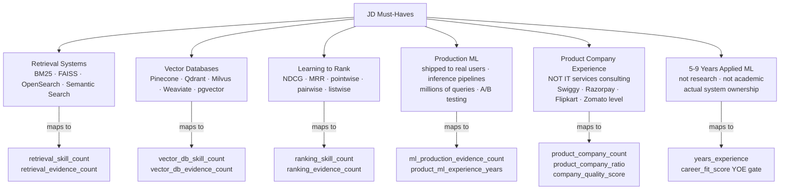
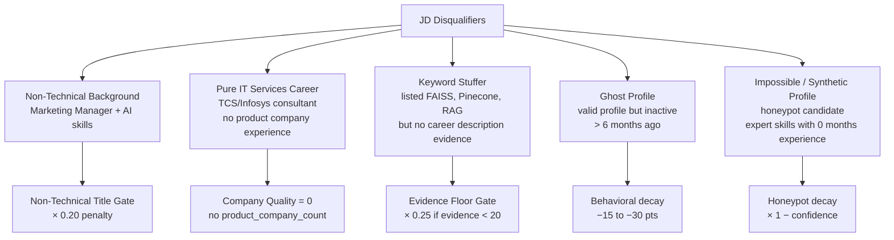
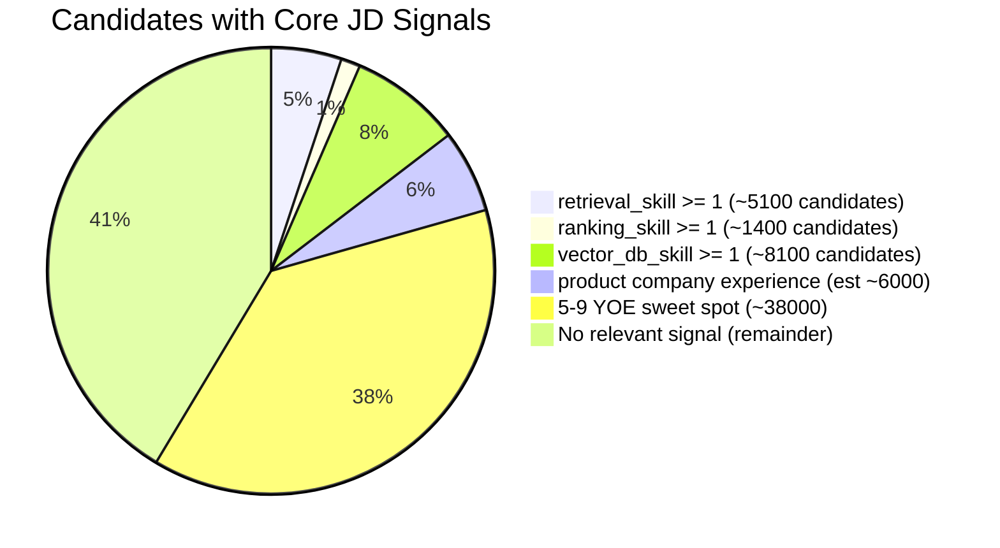
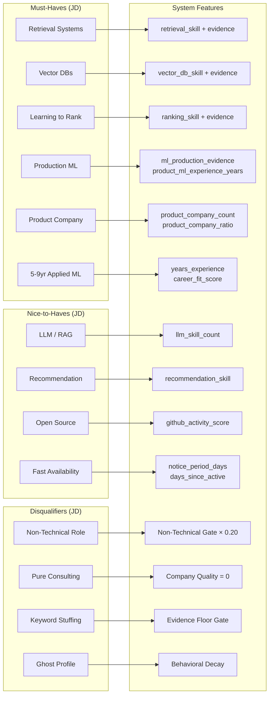

# JD Analysis — Senior AI Engineer, Founding Team

> Mapping of explicit and implicit JD requirements to extracted features and scoring decisions.
> Every mapping is grounded in actual feature extractor and scoring engine logic.

---

## 1. Role Summary

| Attribute | Value |
|---|---|
| Title | Senior AI Engineer — Founding Team |
| Company Type | High-growth Indian product company |
| Experience Required | 5–9 years applied ML (production) |
| Location | India (inferred from salary context: INR LPA) |
| Availability | Preferred < 30 days notice |
| Team Context | "Founding team" — implies high ownership, shipping culture |

---

## 2. Must-Have Requirements

### Requirement-to-Feature Mapping Table

| JD Requirement | Extracted Feature | Scoring Component | Weight |
|---|---|---|---|
| Semantic search experience | `retrieval_skill_count` + `retrieval_evidence_count` | Technical Fit + Evidence | 40% |
| Learning-to-rank / NDCG / MRR | `ranking_skill_count` + `ranking_evidence_count` | Technical Fit + Evidence | 40% |
| Vector database usage (Pinecone, Qdrant, Milvus) | `vector_db_skill_count` + `vector_db_evidence_count` | Technical Fit + Evidence | 30% |
| Production ML systems shipped | `ml_production_evidence_count` | Evidence | 25% |
| Product company background | `product_company_count`, `product_company_ratio` | Company Quality | 10% |
| Applied ML YOE at product companies | `product_ml_experience_years` | Career Fit (dominant factor) | 20% |
| 5–9 years total experience | `years_experience` | Career Fit (sweet spot gate) | 20% |
| Fast availability | `notice_period_days` | Availability | 15% |

---

## 3. Preferred / Nice-to-Have Requirements

| JD Signal | Extracted Feature | Where Scored |
|---|---|---|
| Recommendation systems (Ranking/Discovery) | `recommendation_skill_count` + `recommendation_evidence_count` | Technical Fit + Evidence |
| LLM fine-tuning (RAG, embeddings) | `llm_skill_count` | Technical Fit (lowest weight) |
| Open source / GitHub contributions | `github_activity_score` | Behavioral (≥ 60 → shown in reasoning) |
| Fast response to outreach | `recruiter_response_rate`, `avg_response_time_hours` | Behavioral + Availability |
| Open to work | `open_to_work` | Behavioral |
| Verified profile / professional presence | `verification_score` (email, phone, LinkedIn, GitHub) | Skill Quality boost |

---

## 4. Explicit Disqualifiers

The JD explicitly lists conditions that disqualify a candidate regardless of skill count.

### Hard Disqualifier Gates Implemented

| Disqualifier | Trigger | Penalty Mechanism |
|---|---|---|
| Non-technical title | `title_category == NON_TECHNICAL` OR explicitly banned title | `final_score × 0.20` (80% reduction) |
| Insufficient technical signal | `retrieval+ranking+vector_db+retrieval_evidence+ranking_evidence < 2` | `final_score × 0.05` (95% reduction) |
| No career evidence of retrieval/ranking | `evidence_score < 20` | `final_score × 0.25` (75% reduction) |
| Thin evidence (borderline) | `20 ≤ evidence_score < 30` | `final_score × 0.50` (50% reduction) |
| Honeypot (impossible profile) | `honeypot_confidence ≥ 0.85` OR `sum ≥ 1.60` | `final_score × (1 − confidence)` → ~0 |

---

## 5. Hidden Recruiter Signals

JD phrases that reveal implicit requirements not stated as requirements:

| JD Phrase | Implicit Signal | How It's Captured |
|---|---|---|
| *"Founding team"* | Bias toward "shippers" — high ownership, production systems, not researchers | `ml_production_evidence_count` heavy weight in Evidence (×4) |
| *"keyword stuffers are the primary trap"* | Anti-gaming: skill count alone is not enough | Evidence Score outweighs Technical Fit (25% vs 15%) |
| *"perfect-on-paper candidate who hasn't logged in for 6 months is not hirable"* | Activity recency is critical availability signal | `days_since_active` → behavioral decay −15 to −30 pts |
| *"product company experience over consulting"* | Not just having ML skills but using them in competitive, user-facing environments | `product_company_ratio` in Company Quality + `product_ml_experience_years` in Career Fit |
| *"understands NDCG, MRR, precision@k"* | Ranking metrics literacy — not just "used ML" | `ranking_skill_count` + `ranking_evidence_count` explicitly target these terms |
| *"shipped to real users"* | Proof of production deployment, not toy models | `ml_production_evidence_count` keywords: "shipped", "in production", "millions of queries" |

---

## 6. JD vs Dataset: Signal Rarity Analysis

Understanding how rare genuine JD-fit candidates are in the pool:

| Signal | Approximate Candidate Count | % of Pool |
|---|---|---|
| Any retrieval skill | ~5,100 | 5.1% |
| Any ranking skill (LTR, NDCG) | ~1,400 | 1.4% |
| Any vector DB skill | ~8,100 | 8.1% |
| Both retrieval + ranking | ~1,300 | 1.3% |
| Product company experience | ~6,000 | 6.0% |
| 5–9 YOE sweet spot | ~38,000 | 38.0% |
| All of: retrieval + ranking + product company + 5-9 YOE | ~200–500 | 0.2–0.5% |

> The genuine signal pool is **200–500 candidates**. The top 100 is selected from this pool — which means the ranker must **correctly order** high-quality candidates within a tight competitive band, not just filter out the 99,500 obvious non-fits.

---

## 7. JD Requirement Coverage Map

