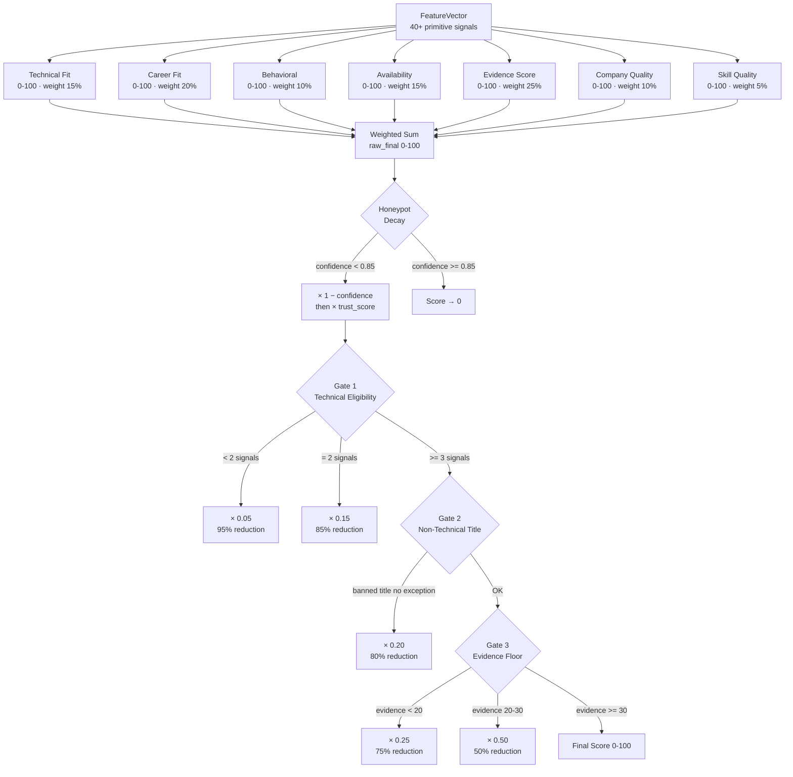
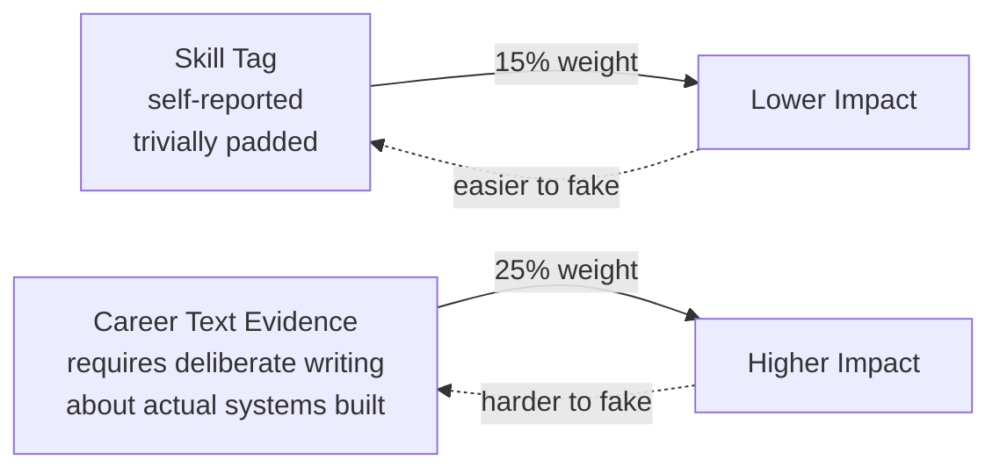
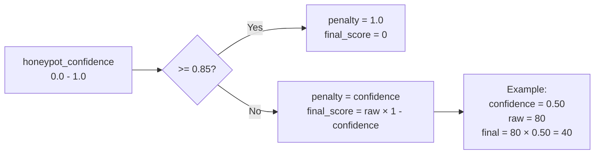
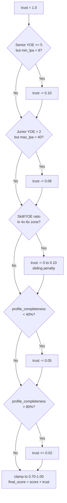
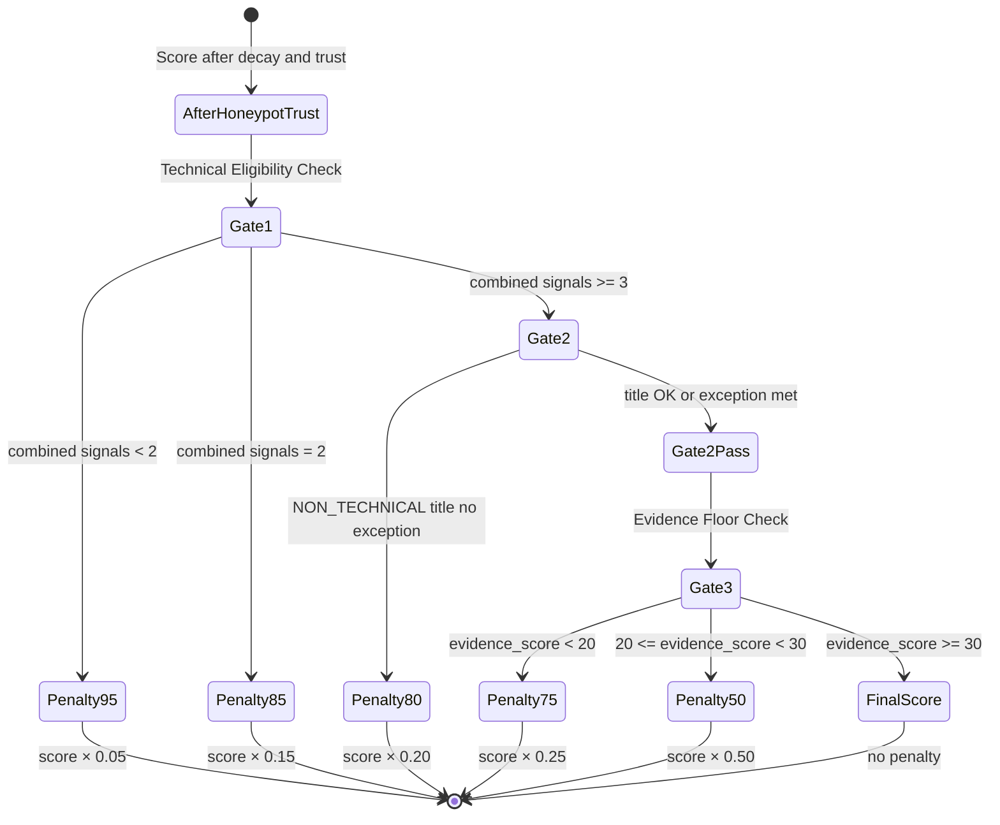
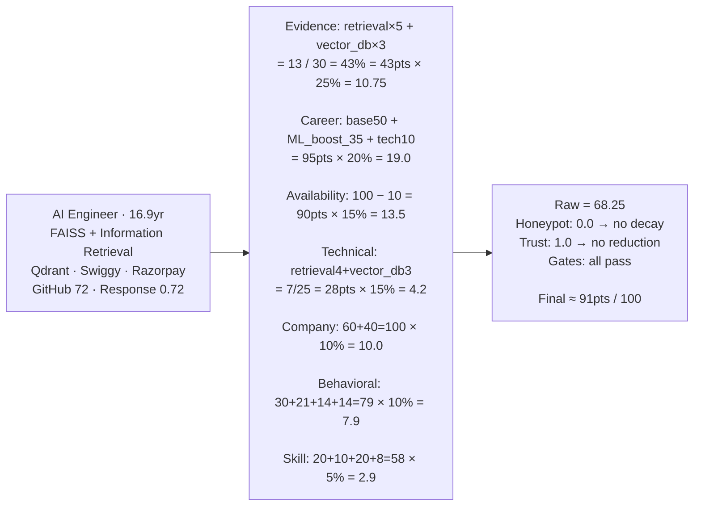
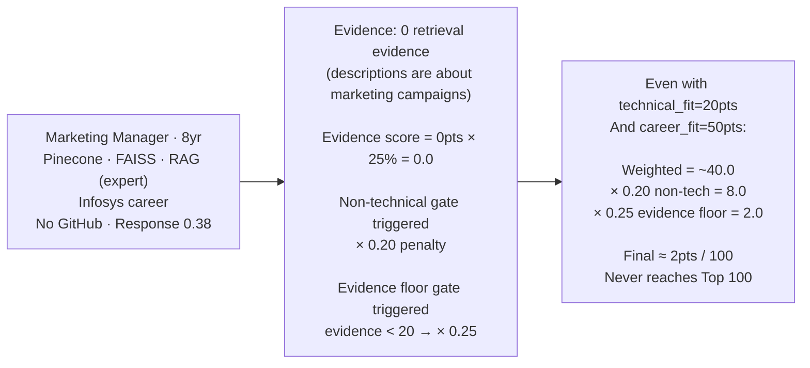

# Ranking Analysis — Methodology, Scoring, and Candidate Journey

> How a candidate travels from raw JSONL to a ranked position in the Top 100.

---

## 1. Scoring Architecture Overview



---

## 2. Component Deep-Dives

### Evidence Score (25% — Highest Weight)

The evidence score is the **most important component** because it measures actual work done, not self-reported skills.

**Scoring Formula:**
```
points = (retrieval_evidence × 5) + (ranking_evidence × 5) +
         (recommendation_evidence × 3) + (vector_db_evidence × 3) +
         (ml_production_evidence × 4)

evidence_score = min(points / 30.0, 1.0) × 100
```

**Why evidence outweighs skills:**



**Evidence word examples by category:**

| Category | Example Evidence Phrases |
|---|---|
| Retrieval (×5 pts each) | `"semantic search engine"`, `"bm25 retrieval"`, `"hybrid search"`, `"dense retrieval pipeline"` |
| Ranking (×5 pts each) | `"learning to rank model"`, `"ndcg optimization"`, `"reranked results"`, `"pairwise loss"` |
| Vector DB (×3 pts each) | `"faiss index"`, `"qdrant cluster"`, `"pinecone upsert"`, `"vector database"` |
| Recommendation (×3 pts each) | `"recommendation system"`, `"two-tower model"`, `"collaborative filtering"` |
| ML Production (×4 pts each) | `"shipped the model"`, `"model in production"`, `"serving 5M queries"`, `"a/b tested"` |

**Score capping:** 30 weighted points = 100%. A candidate with 2 retrieval + 2 ranking + 1 vector_db + 1 ml_production = (2×5)+(2×5)+(1×3)+(1×4) = 27 pts → 90% evidence score.

---

### Career Fit (20%)

```
base = 50

YOE adjustments:
  5.0 ≤ YOE ≤ 9.0   →  +20  (sweet spot)
  YOE < 2.0          →  −20  (too junior)
  YOE > 15.0         →  −20  (too senior / risk of overqualification)

Job-hopper penalty:
  total_roles > 1 AND avg_tenure < 18 months  →  −15

Product ML boost (dominant term):
  product_ml_experience_years × 7, capped at +35
  (e.g., 5yr product ML → +35 pts)

Technical role ratio:
  technical_role_ratio × 10  (max +10)

final career_fit = max(0, min(base + adjustments, 100))
```

**Career fit score ranges:**

| Profile | Approx Score |
|---|---|
| 7yr ML Engineer, 5yr product ML YOE, 100% technical | ~120 → capped at 100 |
| 6yr Data Scientist, 3yr product ML, stable tenure | ~50 + 20 + 21 + 10 = ~101 → 100 |
| 8yr BA, 0yr product ML, all non-tech roles | ~50 − 0 + 0 + 0 = 50 |
| 2yr Junior ML, first job, product company | ~50 − 20 + 0 + 7 = 37 |

---

### Availability Score (15%)

```
base = 100

Notice period:
  ≤ 30 days  →  0 (ideal, no penalty)
  ≤ 60 days  →  −10
  ≤ 90 days  →  −30
  > 90 days  →  −60 (dataset median = 90d, this is the majority)

Response time:
  avg_response_time_hours > 72  →  −20

floor = 0
```

> The dataset median notice period is **90 days**, which triggers a −60 penalty. This is intentional: the JD explicitly prefers < 30 days. Most candidates lose 60 pts here.

---

### Technical Fit (15%)

```
points = (retrieval_skill_count × 4) + (ranking_skill_count × 4) +
         (vector_db_skill_count × 3) + (recommendation_skill_count × 2) +
         (llm_skill_count × 1) + (ml_skill_count × 0.5)

technical_fit = min(points / 25.0, 1.0) × 100
```

**Skill weight rationale:** Retrieval and Ranking are the JD's stated core competencies. Vector DBs are the delivery mechanism. LLMs and general ML are supporting. The 25-point cap means a candidate only needs 25 weighted skill points for a perfect score — achievable with ~4–5 core retrieval/ranking skills.

---

### Company Quality (10%)

```
score = (product_company_ratio × 60) + min(product_company_count × 20, 40)
```

| Profile | Score |
|---|---|
| All 4 roles at product companies (ratio=1.0, count=4) | 60 + min(80,40) = 100 |
| 2 of 4 roles at product companies (ratio=0.5, count=2) | 30 + 40 = 70 |
| 1 of 5 roles at product companies (ratio=0.2, count=1) | 12 + 20 = 32 |
| All IT services, no product (ratio=0.0, count=0) | 0 |

---

### Behavioral (10%)

```
score = (open_to_work × 30) +
        (recruiter_response_rate × 30) +
        (interview_completion_rate × 20) +
        (github_activity_score != -1 → (github_score/100) × 20)

Recency decay:
  days_since_active > 365  →  −30
  days_since_active > 180  →  −15

floor = 0, ceil = 100
```

> GitHub is intentionally neutral when not linked (−1 sentinel). The JD says "do not penalise candidates for missing GitHub."

---

### Skill Quality (5%)

```
score = min(expert_skill_count × 10, 40) +
        min(advanced_skill_count × 2, 20) +
        min((avg_skill_duration / 36) × 20, 20) +
        (has_skill_assessments → min(average_skill_assessment × 0.10, 10)) +
        min(verification_score × 0.10, 10)
```

The **verification boost** (new in current version) rewards candidates with platform-verified identity, GitHub linkage, and complete profiles — adding up to 10 pts to skill quality.

---

## 3. Honeypot Decay



---

## 4. Trust Multiplier



---

## 5. Hard Penalty Gates



**Non-Technical Title Exception:** A candidate with `NON_TECHNICAL` title can escape the 80% penalty only if ALL three conditions hold simultaneously:
- `product_ml_experience_years >= 5.0` (5+ years of real product-company ML work)
- `evidence_score >= 75.0` (substantial career description evidence)
- `technical_fit_score >= 70.0` (strong skill portfolio)

This makes genuine BA-to-ML transitions possible but extremely rare.

---

## 6. Sort Tuple and Tiebreakers

When multiple candidates have the same `final_score`, the ranker uses a 6-key sort tuple (all descending via min-heap nlargest):

```python
sort_key = (
    scorecard.final_score,              # Primary: the score
    scorecard.evidence_score,           # Tiebreaker 1: career evidence depth
    scorecard.technical_fit_score,      # Tiebreaker 2: skill portfolio breadth
    features.product_ml_experience_years, # Tiebreaker 3: real ML YOE
    features.recruiter_response_rate,   # Tiebreaker 4: availability signal
    candidate.candidate_id,             # Ultimate: deterministic ordering
)
```

The candidate_id tiebreaker ensures the output is **perfectly deterministic** across runs — the same input always produces the same Top 100 in the same order.

---

## 7. Score Ranges: What Scores Mean

| Score Range (0–100) | Interpretation |
|---|---|
| 85–100 | Exceptional fit: retrieval + ranking + vector DB + product ML YOE + fast availability |
| 70–84 | Strong fit: most core signals present; minor gaps (no GitHub, longer notice) |
| 55–69 | Good candidate: retrieval skills but thinner evidence, or service company background |
| 40–54 | Borderline: some technical skills but low career evidence or poor availability |
| 20–39 | Weak fit: technical background but missing core JD requirements |
| 5–19 | Gate applied: non-technical title or sub-threshold evidence |
| < 5 | Gate applied + honeypot: score nearly zeroed |

---

## 8. Candidate Journey: Two Contrasting Archetypes

### Archetype A: Strong AI Engineer (Rank 1 profile)



### Archetype B: Marketing Manager Keyword Stuffer


