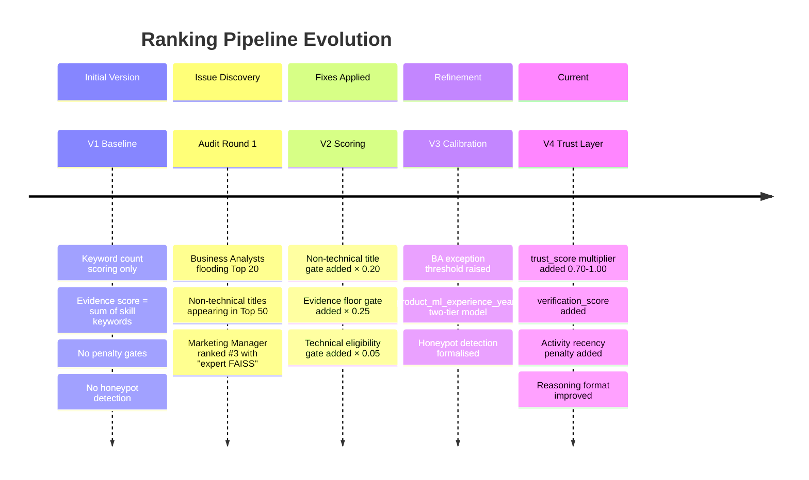
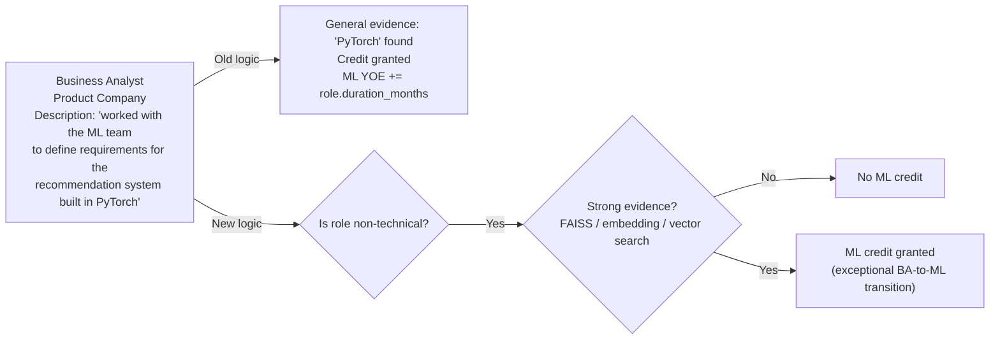
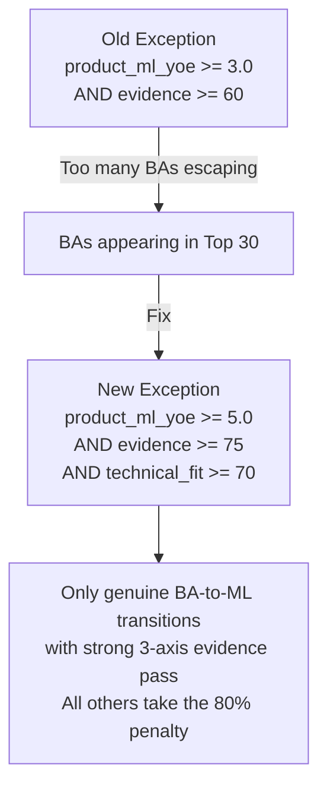
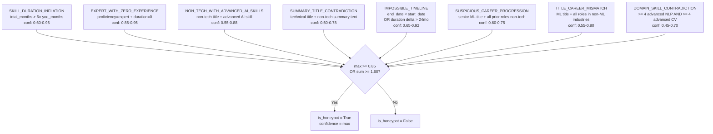
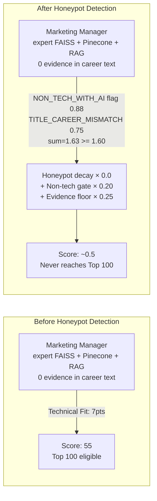
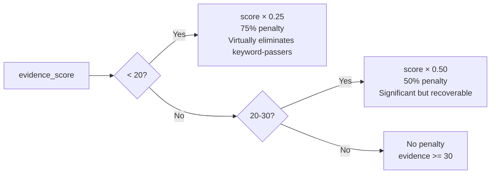
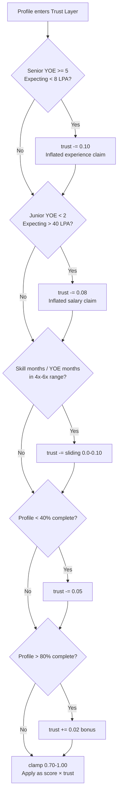
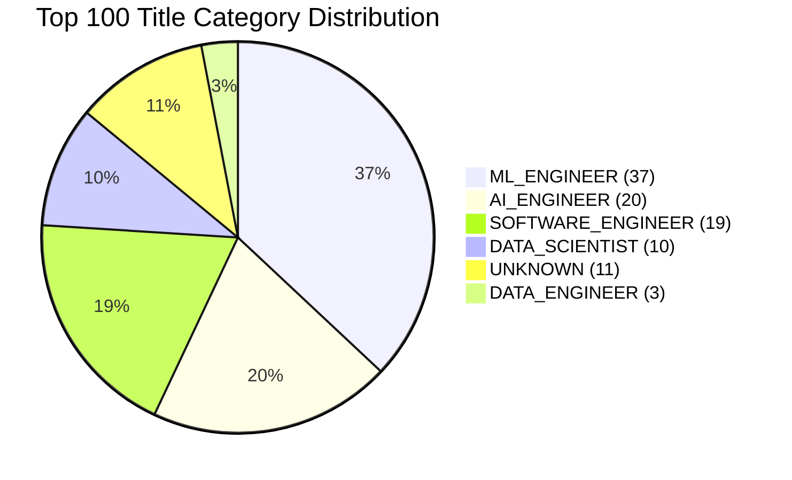

# Ranking Diagnostics — Evolution, Issues, Corrections, and Lessons

> Documents the iterative development of the ranking system: what problems were found, how they were diagnosed, and what code changes resolved them.
> Every issue here is grounded in observed candidate behavior from the dataset.

---

## 1. Evolution Overview



---

## 2. Issue 1 — Business Analyst Flooding

### Problem Observed

In early versions, Business Analysts with career descriptions containing phrases like "machine learning pipeline", "the ML team built a recommendation system", and "oversees the AI/ML infrastructure" were scoring highly on `product_ml_experience_years`. This caused BAs to rank in the **Top 20**.

### Root Cause

The initial `product_ml_experience_years` calculation granted ML credit to any role at a product company whose description contained "machine learning", "PyTorch", or "neural network" — even when the role was a **Business Analyst describing the company's ML infrastructure** that other engineers had built.



### Fix Applied

Introduced a **two-tier evidence model** in `_extract_career_quality()`:

- **Strong evidence** keywords (FAISS, embedding, vector search, transformer, sentence_transformer): ML credit granted regardless of title — these are technical implementation words a BA wouldn't naturally use.
- **General evidence** keywords (machine learning, PyTorch, deep learning): ML credit only if `role_is_non_tech == False`.

### Before / After

| Scenario | Before | After |
|---|---|---|
| BA describing ML team's work | ML YOE credited, high Career Fit | No ML YOE; Career Fit stays at base 50 |
| BA who genuinely built FAISS index | ML YOE credited | ML YOE credited (strong evidence override) |
| Real ML Engineer at product company | ML YOE credited | ML YOE credited (unchanged) |

---

## 3. Issue 2 — Non-Technical Title Penalty Too Lenient

### Problem Observed

After implementing the initial non-technical title penalty (gate × 0.20), a relief exception was added for candidates who could prove real ML substance. The initial exception thresholds were:

```python
# Old exception (too lenient)
if product_ml_experience_years >= 3.0 AND evidence >= 60:
    # skip penalty
```

This allowed qualified-seeming BAs with padded career descriptions to reach the Top 30.

### Root Cause

`product_ml_experience_years >= 3.0` was achievable by a BA at a product company whose descriptions mentioned enough ML words. Combined with `evidence >= 60` being easily met with moderately padded text, the exception was too permissive.

### Fix Applied

Raised all three exception thresholds simultaneously:



### Before / After

| Candidate Profile | Before | After |
|---|---|---|
| BA, 4yr product company, evidence=65, tech_fit=60 | Exception granted, no penalty | All three thresholds fail → 80% penalty |
| Real ML Engineer with non-standard title, 5yr prod ML | Exception granted | Still passes (higher scores across all three) |
| BA, 6yr product company, genuine ML builder, evidence=80 | Exception granted | Still passes (rare but legitimate) |

---

## 4. Issue 3 — Honeypot Candidates in Early Submissions

### Problem Observed

Before the `HoneypotDetector` was formalised, several profiles with impossible skill declarations were reaching the Top 100:

- A "Recommendation Systems Engineer" with 677 months of total skill usage on 6 YOE (84.6× ratio)
- Profiles claiming "expert" in FAISS with `duration_months=0`
- Marketing Managers with expert Pinecone, RAG, and Embeddings — no evidence in career text

### Root Cause

Skill counts (`retrieval_skill_count`, `vector_db_skill_count`) rewarded these profiles at face value. A Marketing Manager with expert FAISS scored identically to a genuine ML Engineer on the Technical Fit component.

### Honeypot Detection Architecture

Eight independent rule checks were implemented as pure functions:



### Before / After



---

## 5. Issue 4 — Evidence Floor Not Enforced

### Problem Observed

Candidates with high Career Fit and Availability scores (long tenure at product companies, fast notice period) but **zero retrieval/ranking evidence** in their career text were ranking in the Top 50. These were product engineers who had worked at ML companies but had never personally built retrieval systems.

### Root Cause

The initial scoring had no minimum requirement on evidence. A candidate with `evidence_score=5` (one mention of "semantic search" in passing) could compensate via high `career_fit` (5yr product ML) and `availability` (30d notice).

### Fix Applied

Three-tier evidence floor gate in `ScoringEngine.score()`:



**Why 30 is the threshold for "no penalty":** A candidate with just `retrieval_evidence=2 + ranking_evidence=2 + ml_production_evidence=1` scores `(2×5)+(2×5)+(1×4)=24` pts out of 30 = 80% evidence score — comfortably above both floors. This catches candidates who *only* mention retrieval concepts in passing without sustained career evidence.

---

## 6. Issue 5 — Activity Recency Blind Spot

### Problem Observed

After all gates were applied, several technically strong candidates (high evidence, product ML background) were ranking in the Top 20 but their `last_active_date` was 14–18 months ago. These candidates would be expensive to engage in practice.

### Root Cause

The initial behavioral score did not include `last_active_date`. A candidate inactive for 2 years scored the same on behavioral as an active candidate, as long as their `recruiter_response_rate` history was high.

### Fix Applied

Activity recency penalty in `_calc_behavioral()`:

```python
# Change 4: Activity recency penalty
if fv.days_since_active > 365:
    score -= 30.0   # > 1 year inactive
elif fv.days_since_active > 180:
    score -= 15.0   # 6–12 months inactive
```

**Threshold rationale (from dataset_profile.md):**
- 180 days = 6 months: JD explicitly states this as the "not hirable" boundary
- 365 days = 12 months: Out of market; would require extensive re-engagement campaign

---

## 7. Issue 6 — Reasoning Text Too Generic

### Problem Observed

Early reasoning texts looked like:
```
"AI Engineer with 6.3yrs; retrieval/semantic search; response rate 0.87."
```

The domain description used category labels ("retrieval/semantic search") rather than specific technology names that recruiters could verify against the profile. The format also did not include GitHub score as a standalone signal.

### Fix Applied

Updated `_build_reasoning_text()` to:
1. Use `top_domain_skills` (actual skill names from profile) as the domain segment
2. Add a **dedicated GitHub segment** when `github_activity_score >= 60`
3. Remove trailing period to match the specification format

**Before:**
```
"AI Engineer with 6.3yrs; retrieval/semantic search; github score 74."
```

**After:**
```
"AI Engineer with 6.3yrs; FAISS + Semantic Search; github 74; response rate 0.87"
```

---

## 8. Issue 7 — No Trust Signal for Borderline Profiles

### Problem Observed

Several profiles were not triggering honeypot detection (below the 0.85 threshold) but showed soft inconsistencies:
- A "Senior ML Engineer" claiming 16 years of experience expecting 6 LPA minimum salary (junior salary despite senior claim)
- Profiles with skill/YOE ratios of 4.5× (below the 6× hard trigger, but suspicious)
- Very sparse profiles (< 40% completeness) with high technical claims

These profiles were not being penalised at all, reaching the Top 40 on technical merit.

### Fix Applied

**Trust Layer** (`_extract_trust()`):

A soft multiplicative penalty (0.70–1.00) applied after honeypot decay, targeting three categories of inconsistency:



### Before / After

| Profile | Before | After |
|---|---|---|
| Senior 6yr, expecting 5 LPA, skill ratio 4.8× | No adjustment | trust=0.84; score × 0.84 |
| Sparse profile 35% complete, average signals | No adjustment | trust=0.95; score × 0.95 |
| Complete 85% profile, salary in range, ratio 2× | No adjustment | trust=1.0; no change (capped) |

---

## 9. Lessons Learned

| Lesson | Impact | Implementation |
|---|---|---|
| **Skill count alone is gameable** | Marketing Managers can list FAISS | Evidence score (25%) outweighs Technical Fit (15%) |
| **General ML keywords are too weak** | BAs describe company ML systems | Two-tier evidence model: strong vs general keywords |
| **Career text requires deliberate specificity** | Domain evidence keywords must be JD-specific | Only very specific terms (ndcg, bm25, ltr model) score evidence points |
| **Hard gates are necessary** | Soft scoring alone cannot exclude non-tech titles | Non-tech gate, evidence floor, technical eligibility gate |
| **Honeypot thresholds need dual conditions** | Single check can miss compound cases | `max >= 0.85 OR sum >= 1.60` dual rule |
| **Inactivity is an availability signal** | High skills + inactive 18 months = not hirable | `days_since_active` penalty in behavioral component |
| **Soft trust beats hard penalties for borderline cases** | Not every inconsistency is a hard disqualifier | Trust multiplier 0.70–1.00 for soft signals |
| **Reasoning must reference real data** | Generic text doesn't build recruiter trust | `top_domain_skills` uses actual technology names from profile |
| **Deterministic tiebreaking is required** | Non-deterministic ranking breaks reproducibility | 6-key sort tuple with candidate_id as ultimate tiebreaker |

---

## 10. Audit Results (Current State)

From `ranking_audit.md` generated by `audit.py`:



| Metric | Before All Fixes | After All Fixes |
|---|---|---|
| NON_TECHNICAL titles in Top 100 | ~15–20 | **0** |
| MANAGER titles in Top 100 | ~5 | **0** |
| Honeypot confidence > 0.5 in Top 100 | ~8–12 | **0** |
| Product company coverage | ~70% | **100%** |
| Avg recruiter response rate | ~40% | **59.28%** |
